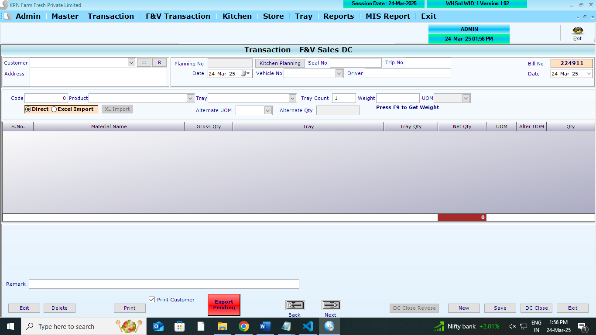
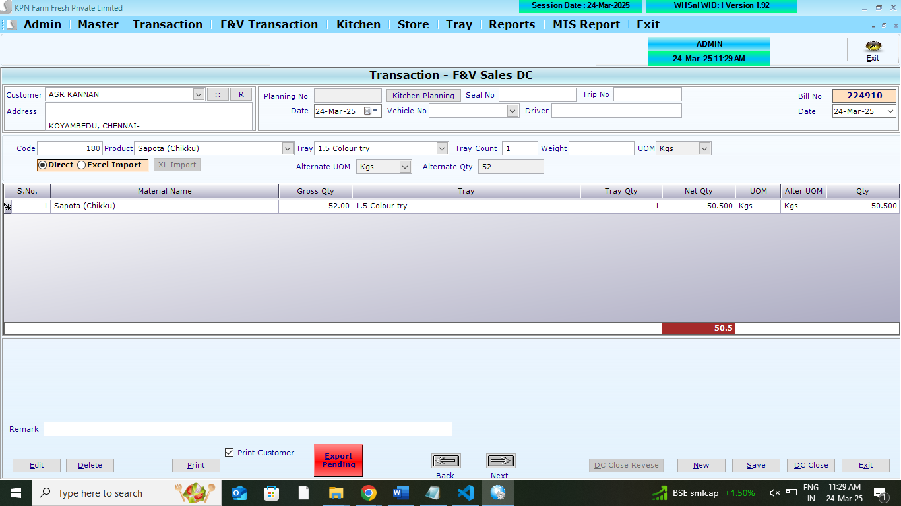
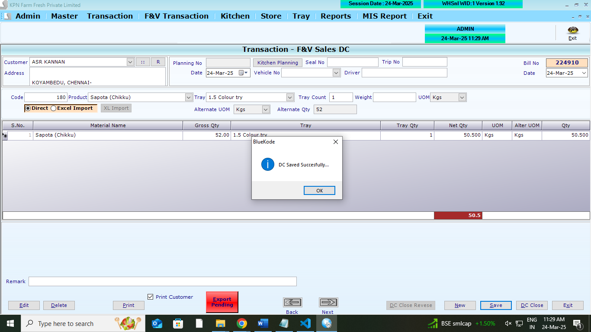

## Main Tables

```
CREATE TABLE [dbo].[DCHdr](
	[D_ID] [int] NOT NULL,
	[D_Year] [int] NOT NULL,
	[D_Date] [datetime] NULL,
	[D_CustId] [int] NULL,
	[D_UID] [int] NULL,
	[D_MUID] [int] NULL,
	[D_Stat] [int] NULL,
	[D_ComId] [int] NOT NULL,
	[D_DelStat] [int] NULL,
	[D_Remark] [varchar](100) NULL,
	[D_ExportPend] [int] NULL,
	[D_Planid] [int] NULL,
	[D_AlocCid] [int] NOT NULL,
	[D_MblExp] [int] NOT NULL,
	[D_Vehicle] [varchar](50) NULL,
	[D_CloseTime] [datetime] NOT NULL,
	[D_VehNoID] [int] NOT NULL,
	[D_SealNo] [varchar](50) NOT NULL,
	[D_Driver] [varchar](50) NOT NULL,
	[D_TRipNo] [int] NOT NULL,
	[D_DirectXL] [int] NOT NULL,
	[D_CreateDt] [datetime] NOT NULL,
	[DCNO] [varchar](100) NULL,
 CONSTRAINT [PK_DcHdr] PRIMARY KEY NONCLUSTERED
(
	[D_ID] ASC,
	[D_ComId] ASC
)WITH (PAD_INDEX = OFF, STATISTICS_NORECOMPUTE = OFF, IGNORE_DUP_KEY = OFF, ALLOW_ROW_LOCKS = ON, ALLOW_PAGE_LOCKS = ON, FILLFACTOR = 80, OPTIMIZE_FOR_SEQUENTIAL_KEY = OFF) ON [PRIMARY]
) ON [PRIMARY]
GO
```

```
CREATE TABLE [dbo].[DCDtl](
	[DD_ID] [int] NULL,
	[DD_Year] [int] NULL,
	[DD_Date] [datetime] NULL,
	[DD_Slno] [int] NULL,
	[DD_Prdid] [int] NULL,
	[DD_batchno] [nvarchar](20) NULL,
	[DD_expdate] [nvarchar](20) NULL,
	[DD_Qty] [decimal](18, 3) NULL,
	[DD_Free] [decimal](18, 3) NULL,
	[DD_ComId] [int] NULL,
	[DD_SuppID] [int] NULL,
	[DD_GrossQty] [numeric](10, 2) NULL,
	[DD_TrayId] [int] NULL,
	[DD_Trayqty] [int] NULL,
	[DD_AlterUOMId] [int] NULL,
	[DD_AlterQty] [numeric](18, 3) NULL,
	[DD_AlterContain] [numeric](18, 3) NULL,
	[DD_UomEdit] [int] NULL,
	[DD_Trayallow] [int] NULL,
	[DD_TrayBal] [int] NULL,
	[DD_IndentNo] [int] NOT NULL,
	[DD_IndentQty] [numeric](18, 3) NOT NULL
) ON [PRIMARY]
GO
```

```
CREATE TABLE [dbo].[DCTrayDtl](
	[ST_ID] [int] NULL,
	[ST_Date] [datetime] NULL,
	[ST_Year] [int] NULL,
	[ST_Slno] [int] NULL,
	[ST_Trayid] [int] NULL,
	[ST_Qty] [int] NULL,
	[ST_ComId] [int] NULL,
	[ST_Custid] [int] NULL
) ON [PRIMARY]
GO

```

## Affted Tables

```
CREATE TABLE [dbo].[Trayledger](
	[Tl_Date] [datetime] NULL,
	[TL_CustId] [int] NULL,
	[TL_RecQty] [int] NULL,
	[TL_IssQty] [int] NULL,
	[TL_TrayID] [int] NULL,
	[TL_WasteQty] [int] NULL,
	[TL_Opening] [int] NULL,
	[TL_Balance] [int] NULL,
	[TL_ComId] [int] NULL,
	[TL_Year] [int] NULL,
	[TL_Type] [int] NULL
) ON [PRIMARY]
GO
```

## REFERANCE SCREENS

**Sales DC opening screen**



**Sales DC opening screen**


**Sales DC entry screen**



**Sales DC save screen**



## LOGICs

1. Select the Customer/Outlets
2. DC close option to be consider here.
3. it means after saving DC, need to list all the DC items against the customer/outlets when DC close flag is open.
4. Direct saving
5. Trayledger concept to be updated
6. Excel import option like Purchase order (product_code,Qty)
7. When exccel import .need to provide screen for feed tray details (Not required for direct)
