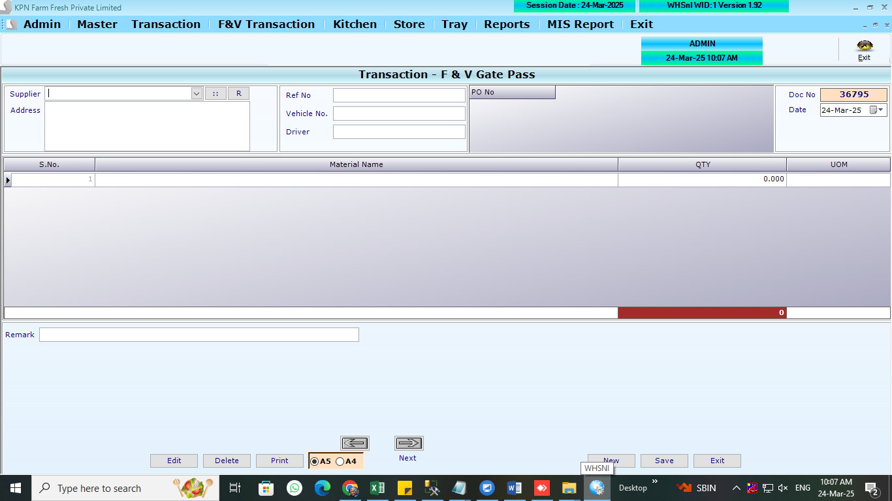
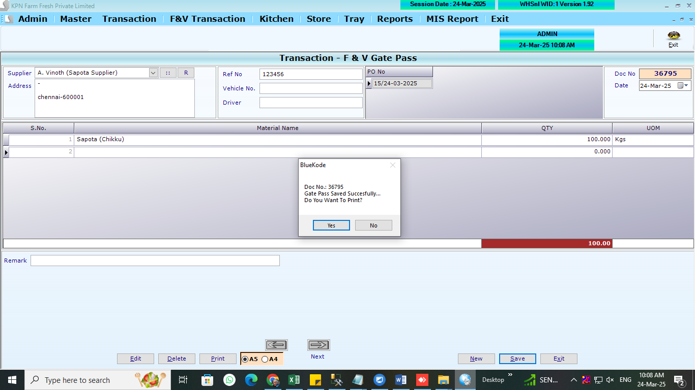

# Gate Pass

## Table used:

1. GatePassHdr
   ```
   CREATE TABLE [dbo].[GatePassHdr](
   	[G_ID] [int] NULL,
   	[G_Year] [int] NULL,
   	[G_Date] [datetime] NULL,
   	[G_SuppId] [int] NULL,
   	[G_RefNo] [varchar](100) NULL,
   	[G_VehNo] [varchar](100) NULL,
   	[G_DriveNo] [varchar](100) NULL,
   	[G_UID] [int] NULL,
   	[G_MUID] [int] NULL,
   	[G_ComId] [int] NULL,
   	[G_Remark] [varchar](500) NULL,
   	[G_Flag] [int] NULL,
   	[G_Invno] [int] NULL,
   	[G_PO] [varchar](max) NOT NULL
   ) ON [PRIMARY] TEXTIMAGE_ON [PRIMARY]
   GO
   ```
2. GatePassDtl

```
CREATE TABLE [dbo].[GatePassDtl](
	[GD_ID] [int] NULL,
	[GD_Year] [int] NULL,
	[GD_Date] [datetime] NULL,
	[GD_Slno] [int] NULL,
	[GD_Prdid] [int] NULL,
	[GD_Qty] [numeric](9, 2) NULL,
	[GD_ComId] [int] NULL,
	[GD_PONO] [int] NOT NULL
) ON [PRIMARY]
GO
```

## REFERANCE SCREENS


**Gatepass opening screen**



**Gatepass save screen**



## LOGICs

-- For FV MRP,GST not applicable

1. List out supplier by sleecting supplier. if po available display the PO list.
2. If we select PO, load and view the PO items on screen
3. show the supplier address
4. `[G_RefNo] [varchar](100) NULL`
   `[G_VehNo] [varchar](100) NULL`
   `[G_DriveNo] [varchar](100) NULL`
5. Qty(`GD_Qty`) against items(`GD_Prdid`) to be feed.

## Ref Queries:

- select \* from [dbo].[GatePassHdr]
- select \* from [dbo].[GatePassDtl]
