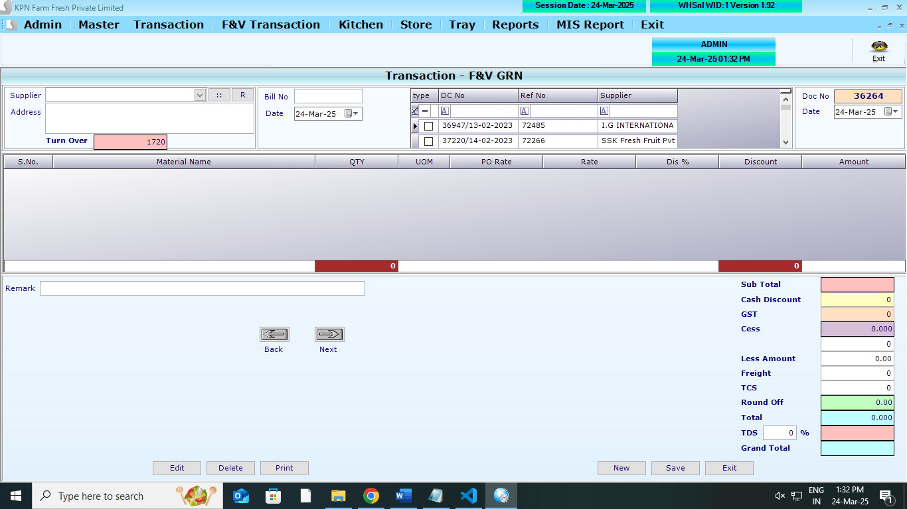
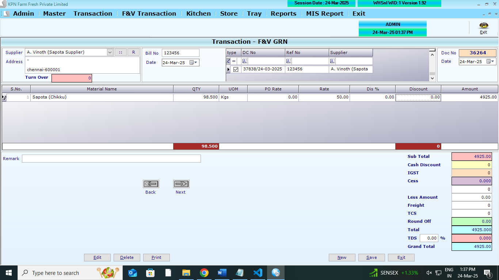
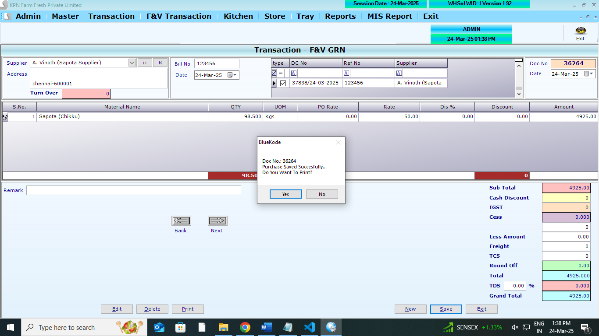
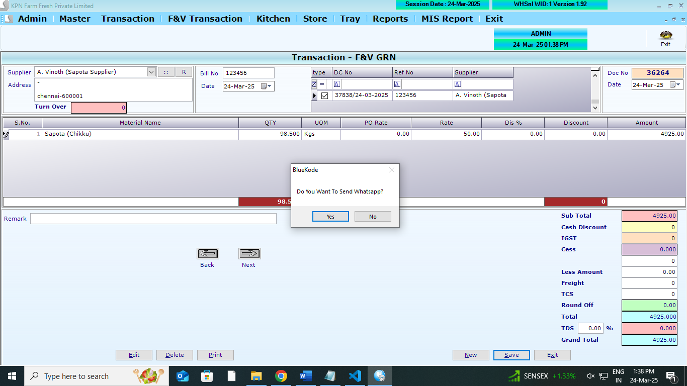

## Main Tables

```
CREATE TABLE [dbo].[PurchaseFVHdr](
	[P_ID] [int] NULL,
	[P_Year] [int] NULL,
	[P_Date] [datetime] NULL,
	[P_SuppId] [int] NULL,
	[P_Tot] [numeric](10, 3) NULL,
	[P_Discount] [numeric](10, 3) NULL,
	[P_VatCstAmt] [numeric](10, 3) NULL,
	[P_GTot] [numeric](10, 3) NULL,
	[P_InvNo] [nvarchar](30) NULL,
	[P_UID] [int] NULL,
	[P_MUID] [int] NULL,
	[P_RoundOff] [numeric](10, 3) NULL,
	[P_Paid] [numeric](10, 3) NULL,
	[P_PayStat] [int] NULL,
	[P_RetAmt] [numeric](10, 3) NULL,
	[P_ComId] [int] NULL,
	[P_InvDt] [datetime] NULL,
	[P_Others] [numeric](10, 3) NULL,
	[P_GSTorIGST] [numeric](10, 3) NULL,
	[P_Advance] [numeric](10, 3) NULL,
	[P_CessAmt] [numeric](10, 2) NULL,
	[P_Remark] [varchar](200) NULL,
	[P_LessAmt] [numeric](10, 2) NULL,
	[P_FVType] [int] NULL,
	[P_Tcs] [numeric](18, 3) NULL,
	[P_DCNo] [varchar](100) NULL,
	[P_closingStock] [numeric](18, 2) NOT NULL,
	[P_Sales] [numeric](18, 2) NOT NULL,
	[P_salesreturn] [numeric](18, 2) NOT NULL,
	[P_openingstock] [numeric](18, 2) NOT NULL,
	[P_purchase] [numeric](18, 2) NOT NULL,
	[P_purchasereturn] [numeric](18, 2) NOT NULL,
	[P_debitnote] [numeric](18, 2) NOT NULL,
	[P_profit] [numeric](18, 2) NOT NULL,
	[P_Per] [numeric](18, 2) NOT NULL,
	[P_averageagreedmargin] [numeric](18, 2) NOT NULL,
	[P_averagefillrate] [numeric](18, 2) NOT NULL,
	[P_TDSPer] [numeric](18, 2) NOT NULL,
	[P_TDSAmt] [numeric](18, 2) NOT NULL,
	[P_Time] [datetime] NULL,
	[P_ReasonDN] [varchar](500) NOT NULL,
	[P_ReasonDNAmt] [decimal](18, 2) NOT NULL,
	[P_DNAmt] [decimal](18, 2) NOT NULL,
 CONSTRAINT [UK_PurchaseFVHdr] UNIQUE NONCLUSTERED
(
	[P_ID] ASC,
	[P_Date] ASC,
	[P_ComId] ASC,
	[P_Year] ASC
)WITH (PAD_INDEX = OFF, STATISTICS_NORECOMPUTE = OFF, IGNORE_DUP_KEY = OFF, ALLOW_ROW_LOCKS = ON, ALLOW_PAGE_LOCKS = ON, FILLFACTOR = 80, OPTIMIZE_FOR_SEQUENTIAL_KEY = OFF) ON [PRIMARY]
) ON [PRIMARY]
GO
```

```
CREATE TABLE [dbo].[PurchaseFVDtl](
	[PD_ID] [int] NULL,
	[PD_Year] [int] NULL,
	[PD_Date] [datetime] NULL,
	[PD_Slno] [int] NULL,
	[PD_Prdid] [int] NULL,
	[PD_batchno] [nvarchar](20) NULL,
	[PD_expdate] [nvarchar](20) NULL,
	[PD_Qty] [decimal](18, 3) NULL,
	[PD_Free] [decimal](18, 3) NULL,
	[PD_Dis] [decimal](18, 2) NULL,
	[PD_DisAmt] [numeric](10, 3) NULL,
	[PD_Vat] [decimal](18, 2) NULL,
	[PD_VatAmt] [numeric](10, 3) NULL,
	[PD_Rate] [numeric](10, 3) NULL,
	[PD_Amt] [numeric](10, 3) NULL,
	[PD_ComId] [int] NULL,
	[PD_SuppID] [int] NULL,
	[PD_PONO] [int] NULL,
	[pd_AMargin] [numeric](10, 2) NULL,
	[PD_SalRate] [numeric](10, 2) NULL,
	[PD_MRP] [numeric](10, 2) NULL,
	[PD_CGST] [numeric](10, 2) NULL,
	[PD_SGST] [numeric](10, 2) NULL,
	[PD_CSS] [numeric](10, 2) NULL,
	[PD_CessAmt] [numeric](10, 2) NULL,
	[PD_POQty] [numeric](18, 3) NULL,
	[PD_Packflag] [int] NULL,
	[PD_Packqty] [numeric](9, 3) NULL,
	[PD_WHMargin] [numeric](18, 2) NULL,
	[PD_SalesMargin] [numeric](18, 2) NULL,
	[PD_ReasonDNAmt] [decimal](18, 2) NOT NULL,
	[PD_DNAmt] [decimal](18, 2) NOT NULL,
	[PD_RetQty] [numeric](18, 3) NULL
) ON [PRIMARY]
GO
```

```
CREATE TABLE [dbo].[Partyledger](
	[PL_id] [int] NULL,
	[PL_Did] [int] NULL,
	[PL_Date] [datetime] NULL,
	[PL_Type] [nvarchar](2) NULL,
	[PL_No] [int] NULL,
	[PL_Mode] [int] NULL,
	[PL_Chequeno] [nvarchar](15) NULL,
	[PL_Cdate] [datetime] NULL,
	[PL_Credit] [decimal](18, 2) NULL,
	[PL_Debit] [decimal](18, 2) NULL,
	[PL_Remarks] [nvarchar](max) NULL,
	[PL_PtTyp] [nvarchar](5) NULL,
	[PL_ComId] [int] NULL
) ON [PRIMARY] TEXTIMAGE_ON [PRIMARY]
GO
```

## Affected Tables

```
Product Master
```

```
CREATE TABLE [dbo].[PurchaseDCHdr](
	[PD_ID] [int] NULL,
	[PD_Year] [int] NULL,
	[PD_Date] [datetime] NULL,
	[PD_Tot] [numeric](9, 2) NULL,
	[PD_Discount] [numeric](9, 2) NULL,
	[PD_VatCstAmt] [numeric](9, 2) NULL,
	[PD_GTot] [numeric](9, 2) NULL,
	[PD_RefNo] [varchar](100) NULL,
	[PD_UID] [int] NULL,
	[PD_MUID] [int] NULL,
	[PD_RoundOff] [numeric](9, 2) NULL,
	[PD_Paid] [numeric](9, 2) NULL,
	[PD_PayStat] [int] NULL,
	[PD_RetAmt] [numeric](9, 2) NULL,
	[PD_ComId] [int] NULL,
	[PD_Others] [numeric](9, 2) NULL,
	[PD_GSTorIGST] [numeric](9, 2) NULL,
	[PD_Advance] [numeric](9, 2) NULL,
	[PD_CessAmt] [numeric](9, 2) NULL,
	[PD_Remark] [varchar](500) NULL,
	[PD_LessAmt] [numeric](9, 2) NULL,
	[PD_FVType] [int] NULL,
	[PD_Tcs] [numeric](9, 2) NULL,
	[PD_Flag] [int] NULL,
	[PD_Invno] [int] NULL,
	[PD_TotTraycount] [int] NULL,
	[PD_SuppId] [int] NULL,
	[PD_Dcno] [varchar](100) NULL,
	[PD_AutoAlt] [int] NOT NULL,
	[PD_POno] [varchar](100) NULL
) ON [PRIMARY]
GO
```

## REFERANCE SCREENS

**GRN opening screen**



**GRN entry screen**



**GRN save screen**



**GRN save screen**



## LOGICs

1. **Memeo Selection**: List out all memos/Dcs where condtion is `PM_PayStat is 0` by click view
2. By slecting any DC . FIll all the item against Memo inside the table
3. Partyledger

- ** Rule 1**: If any item is not present in the partyledger, then it will be added
- if PL_Debit exsists , then it will be added to PL_Debit .
  - `PL_Debit`
  - `PL_Type` to be `E` for purchase
  - `PL_No` - this Doc number (`P_ID`)
  - `PL_Mode` - `0` to be posted
  - `PL_Chequeno` - `empty` to be posted
  - `PL_Cdate` - `doc date` to be posted
  - `PL_Credit` - `0` to be posted
  - `PL_Remarks` - `Purchase inv no (party invoice number)` to be posted
  - `PL_PtTyp` - `S` to be posted - (`C` for customer)
  - `PL_ComId` - `company_id` to be posted

5. `PD_Flag` - 1
6. `PD_Invno` - `P_ID` of main table docnumber
7. After inserting above into respective tables. need to update `customer/suppliers` table `balance` column
   balance to be updated in supplier master (`exsisiting_balance+new_balance`)
