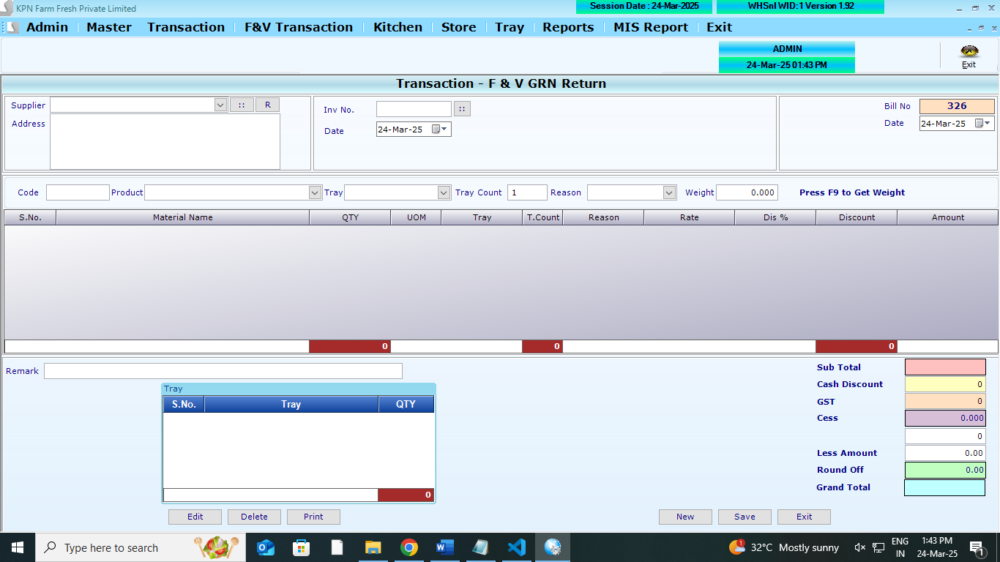
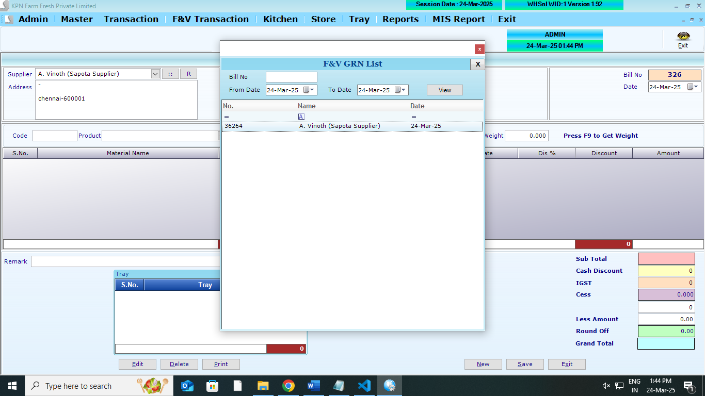
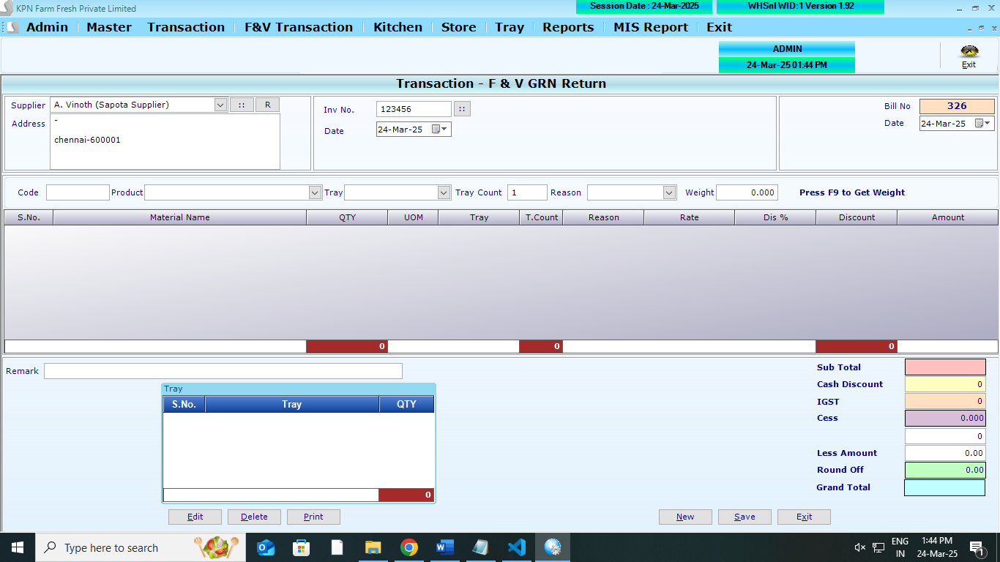
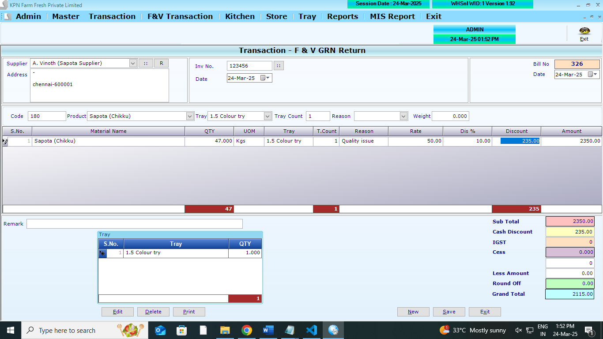
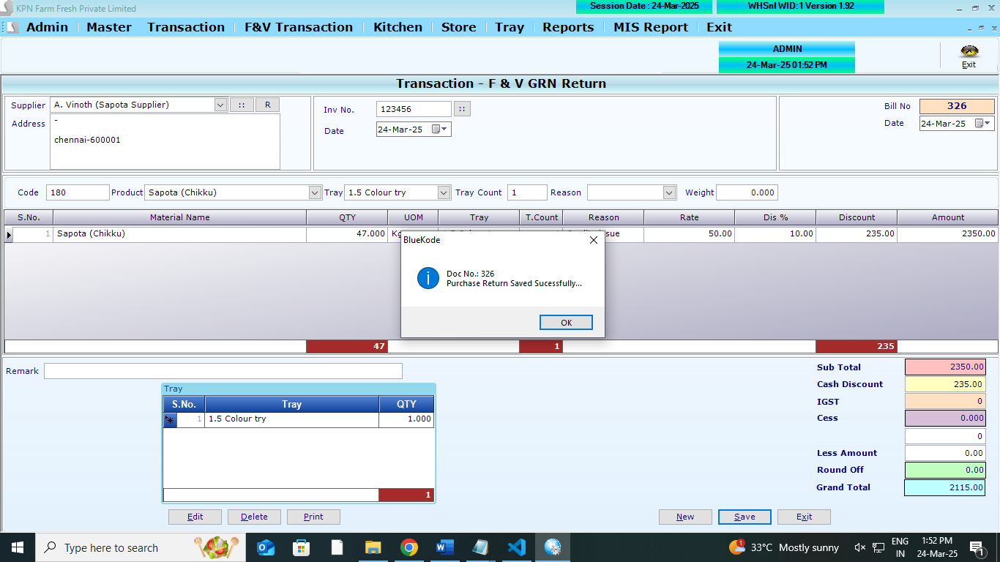

## Main Table

```
CREATE TABLE [dbo].[PurGRNRethdr](
	[PR_ID] [int] NULL,
	[PR_Year] [int] NULL,
	[PR_Date] [datetime] NULL,
	[PR_SuppId] [int] NULL,
	[PR_Tot] [numeric](9, 2) NULL,
	[PR_Discount] [numeric](9, 2) NULL,
	[PR_VatCstAmt] [numeric](9, 2) NULL,
	[PR_GTot] [numeric](9, 2) NULL,
	[PR_PurDoc] [int] NULL,
	[PR_PurInvNo] [varchar](100) NULL,
	[PR_UID] [int] NULL,
	[PR_MUID] [int] NULL,
	[PR_RoundOff] [numeric](9, 2) NULL,
	[PR_ComId] [int] NULL,
	[PR_PurInvDt] [datetime] NULL,
	[PR_Type] [int] NULL,
	[PR_Cess] [numeric](9, 2) NULL,
	[PR_GSTorIGST] [int] NULL,
	[PR_Remark] [varchar](100) NULL
) ON [PRIMARY]
GO
```

```
CREATE TABLE [dbo].[PurGRNRetdtl](
	[PRD_ID] [int] NULL,
	[PRD_Year] [int] NULL,
	[PRD_Date] [datetime] NULL,
	[PRD_Slno] [int] NULL,
	[PRD_Prdid] [int] NULL,
	[PRD_batchno] [varchar](100) NULL,
	[PRD_expdate] [datetime] NULL,
	[PRD_Qty] [numeric](9, 3) NULL,
	[PRD_QtyAct] [numeric](9, 3) NULL,
	[PRD_Free] [numeric](9, 3) NULL,
	[PRD_FreeAct] [numeric](9, 3) NULL,
	[PRD_Dis] [numeric](9, 2) NULL,
	[PRD_DisAmt] [numeric](9, 2) NULL,
	[PRD_Vat] [numeric](9, 2) NULL,
	[PRD_VatAmt] [numeric](9, 2) NULL,
	[PRD_Rate] [numeric](9, 2) NULL,
	[PRD_Amt] [numeric](9, 2) NULL,
	[PRD_ComId] [int] NULL,
	[PRD_SuppID] [int] NULL,
	[PRD_CGST] [numeric](9, 2) NULL,
	[PRD_SGST] [numeric](9, 2) NULL,
	[PRD_Cess] [numeric](9, 2) NULL,
	[PRD_CessAmt] [numeric](9, 2) NULL,
	[PRD_Tray] [int] NULL,
	[PRD_Traycount] [int] NULL,
	[PRD_Reason] [int] NULL
) ON [PRIMARY]
GO
```

```
CREATE TABLE [dbo].[PurchaseTryRetDtl](
	[PT_Id] [int] NULL,
	[PT_Year] [int] NULL,
	[PT_Date] [datetime] NULL,
	[PT_Slno] [int] NULL,
	[PT_Trayid] [int] NULL,
	[PT_Qty] [int] NULL,
	[PT_comid] [int] NULL
) ON [PRIMARY]
GO
```

## Affected Table

```
CREATE TABLE [dbo].[StockLedger](
	[SL_Date] [datetime] NULL,
	[SL_items] [int] NULL,
	[SL_batchno] [nvarchar](20) NULL,
	[SL_expdate] [nvarchar](20) NULL,
	[SL_PurQty] [decimal](18, 3) NULL,
	[SL_SalQty] [decimal](18, 3) NULL,
	[SL_WastQty] [decimal](18, 3) NULL,
	[SL_SalRetQty] [decimal](18, 3) NULL,
	[SL_PurRetQty] [decimal](18, 3) NULL,
	[SL_UID] [int] NULL,
	[SL_MUID] [int] NULL,
	[SL_ComId] [int] NULL,
	[SL_StkCorrQty] [numeric](10, 3) NULL,
	[SL_StkcorrFlag] [int] NULL,
	[SL_SCDate] [date] NULL,
	[SL_SCUid] [int] NULL,
	[SL_DCRetQty] [numeric](9, 3) NULL,
	[SL_Closing] [numeric](18, 3) NULL,
	[SL_MultiUnit] [int] NULL
) ON [PRIMARY]
GO
```

```
CREATE TABLE [dbo].[Partyledger](
	[PL_id] [int] NULL,
	[PL_Did] [int] NULL,
	[PL_Date] [datetime] NULL,
	[PL_Type] [nvarchar](2) NULL,
	[PL_No] [int] NULL,
	[PL_Mode] [int] NULL,
	[PL_Chequeno] [nvarchar](15) NULL,
	[PL_Cdate] [datetime] NULL,
	[PL_Credit] [decimal](18, 2) NULL,
	[PL_Debit] [decimal](18, 2) NULL,
	[PL_Remarks] [nvarchar](max) NULL,
	[PL_PtTyp] [nvarchar](5) NULL,
	[PL_ComId] [int] NULL
) ON [PRIMARY] TEXTIMAGE_ON [PRIMARY]
GO
```

```
CREATE TABLE [dbo].[Trayledger](
	[Tl_Date] [datetime] NULL,
	[TL_CustId] [int] NULL,
	[TL_RecQty] [int] NULL,
	[TL_IssQty] [int] NULL,
	[TL_TrayID] [int] NULL,
	[TL_WasteQty] [int] NULL,
	[TL_Opening] [int] NULL,
	[TL_Balance] [int] NULL,
	[TL_ComId] [int] NULL,
	[TL_Year] [int] NULL,
	[TL_Type] [int] NULL
) ON [PRIMARY]
GO
```

## REFERANCE SCREENS

**GRN return opening screen**



**GRN return opening screen**



**GRN return entry screen**



**GRN return entry screen**



**GRN return save screen**



## LOGICs

1. Bill wise/GRN wise return
2. When Bill wise/GRN wise return, need to check in PurchaseMemoDtl - `PD_RetQty`
3. if `PD_RetQty` is there, no need to update Stock Ledger `SL_PurRetQty`

4. Partyledger

- ** Rule 1**: If any item is not present in the partyledger, then it will be added
- if PL_Credit exsists , then it will be added to PL_Credit .
  - `PL_Credit`
  - `PL_Type` to be `PR` for purchase
  - `PL_No` - this Doc number (`PR_ID`)
  - `PL_Mode` - `0` to be posted
  - `PL_Chequeno` - `empty` to be posted
  - `PL_Cdate` - `doc date` to be posted
  - `PL_Credit` - `0` to be posted
  - `PL_Remarks` - `Purchase return (PR_ID)` to be posted
  - `PL_PtTyp` - `PR` to be posted
  - `PL_ComId` - `company_id` to be posted

5. whereever Tray is there, TrayLedger table will affect
