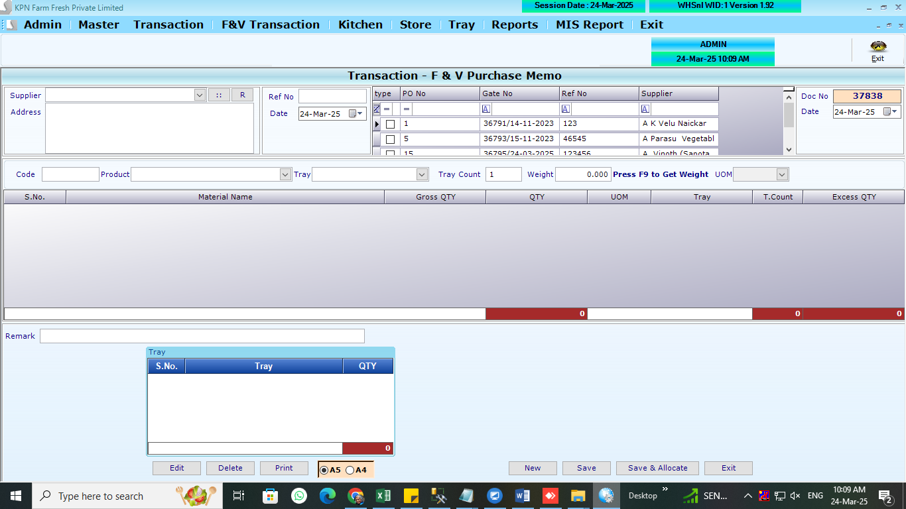
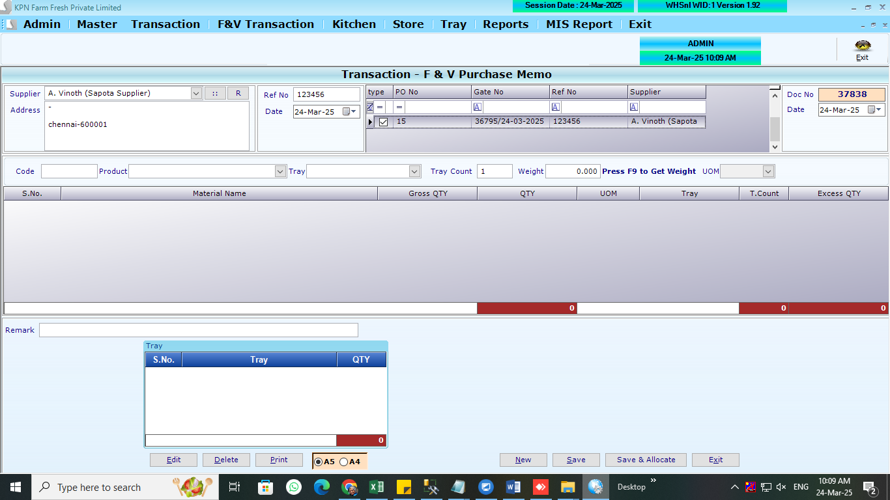
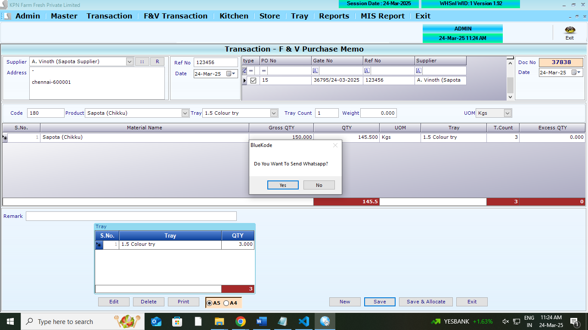

## Main Tables

```
CREATE TABLE [dbo].[PurchaseDCHdr](
	[PD_ID] [int] NULL,
	[PD_Year] [int] NULL,
	[PD_Date] [datetime] NULL,
	[PD_Tot] [numeric](9, 2) NULL,
	[PD_Discount] [numeric](9, 2) NULL,
	[PD_VatCstAmt] [numeric](9, 2) NULL,
	[PD_GTot] [numeric](9, 2) NULL,
	[PD_RefNo] [varchar](100) NULL,
	[PD_UID] [int] NULL,
	[PD_MUID] [int] NULL,
	[PD_RoundOff] [numeric](9, 2) NULL,
	[PD_Paid] [numeric](9, 2) NULL,
	[PD_PayStat] [int] NULL,
	[PD_RetAmt] [numeric](9, 2) NULL,
	[PD_ComId] [int] NULL,
	[PD_Others] [numeric](9, 2) NULL,
	[PD_GSTorIGST] [numeric](9, 2) NULL,
	[PD_Advance] [numeric](9, 2) NULL,
	[PD_CessAmt] [numeric](9, 2) NULL,
	[PD_Remark] [varchar](500) NULL,
	[PD_LessAmt] [numeric](9, 2) NULL,
	[PD_FVType] [int] NULL,
	[PD_Tcs] [numeric](9, 2) NULL,
	[PD_Flag] [int] NULL,
	[PD_Invno] [int] NULL,
	[PD_TotTraycount] [int] NULL,
	[PD_SuppId] [int] NULL,
	[PD_Dcno] [varchar](100) NULL,
	[PD_AutoAlt] [int] NOT NULL,
	[PD_POno] [varchar](100) NULL
) ON [PRIMARY]
GO
```

```
CREATE TABLE [dbo].[PurchaseDCDtl](
	[PDD_ID] [int] NULL,
	[PDD_Year] [int] NULL,
	[PDD_Date] [datetime] NULL,
	[PDD_Slno] [int] NULL,
	[PDD_Prdid] [int] NULL,
	[PDD_batchno] [nvarchar](40) NULL,
	[PDD_expdate] [nvarchar](40) NULL,
	[PDD_Qty] [numeric](9, 2) NULL,
	[PDD_Free] [numeric](9, 2) NULL,
	[PDD_Dis] [numeric](9, 2) NULL,
	[PDD_DisAmt] [numeric](9, 2) NULL,
	[PDD_Vat] [numeric](9, 2) NULL,
	[PDD_VatAmt] [numeric](9, 2) NULL,
	[PDD_Rate] [numeric](9, 2) NULL,
	[PDD_Amt] [numeric](9, 2) NULL,
	[PDD_ComId] [int] NULL,
	[PDD_AMargin] [numeric](9, 2) NULL,
	[PDD_SalRate] [numeric](9, 2) NULL,
	[PDD_MRP] [numeric](9, 2) NULL,
	[PDD_CGST] [numeric](9, 2) NULL,
	[PDD_SGST] [numeric](9, 2) NULL,
	[PDD_CSS] [numeric](9, 2) NULL,
	[PDD_CessAmt] [numeric](9, 2) NULL,
	[PDD_POQty] [numeric](9, 2) NULL,
	[PDD_Flag] [int] NULL,
	[PDD_Tray] [int] NULL,
	[PDD_Traycount] [int] NULL,
	[PDD_suppid] [int] NULL,
	[PDD_Retqty] [numeric](9, 2) NULL,
	[PDD_ExcessQty] [numeric](18, 3) NULL,
	[PDD_Grossqty] [numeric](9, 3) NULL,
	[PDD_AutoAlt] [int] NOT NULL
) ON [PRIMARY]
GO
```

```
CREATE TABLE [dbo].[PurchaseTryDtl](
	[PT_ID] [int] NULL,
	[PT_Year] [int] NULL,
	[PT_Date] [datetime] NULL,
	[PT_Slno] [int] NULL,
	[PT_Trayid] [int] NULL,
	[PT_Qty] [decimal](18, 3) NULL,
	[PT_ComId] [int] NULL
) ON [PRIMARY]
GO
```

```
CREATE TABLE [dbo].[PurchorderFVHdr](
	[PO_ID] [int] NULL,
	[PO_Year] [int] NULL,
	[PO_Date] [datetime] NULL,
	[PO_SuppId] [int] NULL,
	[PO_InvNo] [varchar](50) NULL,
	[PO_InvDt] [datetime] NULL,
	[PO_Expiry] [datetime] NULL,
	[PO_Status] [int] NULL,
	[PO_UID] [int] NULL,
	[PO_MUID] [int] NULL,
	[PO_ComId] [int] NULL,
	[PO_subTot] [numeric](10, 2) NULL,
	[PO_GSTAmt] [numeric](10, 2) NULL,
	[PO_Roff] [numeric](10, 2) NULL,
	[PO_Gtot] [numeric](10, 2) NULL,
	[PO_CessAmt] [numeric](10, 2) NULL,
	[PO_MBQRefNo] [int] NULL,
	[PO_GRN] [int] NULL,
	[PO_MStatus] [int] NULL,
	[PO_Auto] [int] NULL,
	[PO_PORefno] [int] NULL,
	[PO_DeliveryDate] [datetime] NULL,
	[PO_PurMemo] [int] NOT NULL,
	[PO_time] [datetime] NULL
) ON [PRIMARY]
GO
```

```
CREATE TABLE [dbo].[PurchorderFVDtl](
	[POD_ID] [int] NULL,
	[POD_Year] [int] NULL,
	[POD_Date] [datetime] NULL,
	[POD_SuppID] [int] NULL,
	[POD_Slno] [int] NULL,
	[POD_Prdid] [int] NULL,
	[POD_PurRate] [decimal](18, 0) NULL,
	[POD_GST] [decimal](10, 2) NULL,
	[POD_Rate] [decimal](10, 2) NULL,
	[POD_Qty] [decimal](10, 2) NULL,
	[POD_Amt] [decimal](10, 2) NULL,
	[POD_ComId] [int] NULL,
	[POD_RecQty] [numeric](10, 2) NULL,
	[POD_GSTAmt] [numeric](10, 2) NULL,
	[POD_CGST] [numeric](10, 2) NULL,
	[POD_SGST] [numeric](10, 2) NULL,
	[POD_CSS] [numeric](10, 2) NULL,
	[POD_CessAmt] [numeric](10, 2) NULL
) ON [PRIMARY]
GO
```

## Affted Tables

```
CREATE TABLE [dbo].[StockLedger](
	[SL_Date] [datetime] NULL,
	[SL_items] [int] NULL,
	[SL_batchno] [nvarchar](20) NULL,
	[SL_expdate] [nvarchar](20) NULL,
	[SL_PurQty] [decimal](18, 3) NULL,
	[SL_SalQty] [decimal](18, 3) NULL,
	[SL_WastQty] [decimal](18, 3) NULL,
	[SL_SalRetQty] [decimal](18, 3) NULL,
	[SL_PurRetQty] [decimal](18, 3) NULL,
	[SL_UID] [int] NULL,
	[SL_MUID] [int] NULL,
	[SL_ComId] [int] NULL,
	[SL_StkCorrQty] [numeric](10, 3) NULL,
	[SL_StkcorrFlag] [int] NULL,
	[SL_SCDate] [date] NULL,
	[SL_SCUid] [int] NULL,
	[SL_DCRetQty] [numeric](9, 3) NULL,
	[SL_Closing] [numeric](18, 3) NULL,
	[SL_MultiUnit] [int] NULL
) ON [PRIMARY]
GO
```

```
CREATE TABLE [dbo].[Trayledger](
	[Tl_Date] [datetime] NULL,
	[TL_CustId] [int] NULL,
	[TL_RecQty] [int] NULL,
	[TL_IssQty] [int] NULL,
	[TL_TrayID] [int] NULL,
	[TL_WasteQty] [int] NULL,
	[TL_Opening] [int] NULL,
	[TL_Balance] [int] NULL,
	[TL_ComId] [int] NULL,
	[TL_Year] [int] NULL,
	[TL_Type] [int] NULL
) ON [PRIMARY]
GO
```

```
  CREATE TABLE [dbo].[PurchorderFVHdr](
  	[PO_ID] [int] NULL,
  	[PO_Year] [int] NULL,
  	[PO_Date] [datetime] NULL,
  	[PO_SuppId] [int] NULL,
  	[PO_InvNo] [varchar](50) NULL, - not used
  	[PO_InvDt] [datetime] NULL, - not used
  	[PO_Expiry] [datetime] NULL,
  	[PO_Status] [int] NULL,
  	[PO_UID] [int] NULL, - created_by
  	[PO_MUID] [int] NULL, - updated_by
  	[PO_ComId] [int] NULL, - company_id
  	[PO_subTot] [numeric](10, 2) NULL,
  	[PO_GSTAmt] [numeric](10, 2) NULL,
  	[PO_Roff] [numeric](10, 2) NULL,
  	[PO_Gtot] [numeric](10, 2) NULL,
  	[PO_CessAmt] [numeric](10, 2) NULL,
  	[PO_MBQRefNo] [int] NULL,
  	[PO_GRN] [int] NULL,  - not used
  	[PO_MStatus] [int] NULL,  - not used
  	[PO_Auto] [int] NULL, - manual -0, auto-1
  	[PO_PORefno] [int] NULL,
  	[PO_time] [datetime] NULL,
  	[PO_Amendment] [int] NOT NULL
  ) ON [PRIMARY]
  GO
```

```
CREATE TABLE [dbo].[PurchorderFVDtl](
	[POD_ID] [int] NULL,
	[POD_Year] [int] NULL,
	[POD_Date] [datetime] NULL,
	[POD_Slno] [int] NULL,
	[POD_Prdid] [int] NULL,
	[POD_Stkhold] [decimal](10, 2) NULL,
	[POD_Balance] [decimal](10, 2) NULL,
	[POD_MRP] [decimal](10, 2) NULL,
	[POD_PurRate] [decimal](18, 0) NULL,
	[POD_GST] [decimal](10, 2) NULL,
	[POD_Rate] [decimal](10, 2) NULL,
	[POD_Qty] [decimal](10, 2) NULL,
	[POD_Amt] [decimal](10, 2) NULL,
	[POD_ComId] [int] NULL,
	[POD_SuppID] [int] NULL,
	[POD_RecQty] [numeric](10, 2) NULL,
	[POD_GSTAmt] [numeric](10, 2) NULL,
	[POD_CGST] [numeric](10, 2) NULL,
	[POD_SGST] [numeric](10, 2) NULL,
	[POD_CSS] [numeric](10, 2) NULL,
	[POD_CessAmt] [numeric](10, 2) NULL,
	[POD_CaseQty] [int] NULL,
	[POD_orderQty] [decimal](10, 2) NULL,
	[POD_Cushion] [decimal](10, 2) NULL
) ON [PRIMARY]
GO
```

```
ProductMaster
```

## REFERANCE SCREENS

**Purchase Memo opening screen**



**Purchase Memo opening screen**



**Purchase Memo opening screen**


**Purchase Memo opening screen**



## LOGICs

1. Select the supplier
2. List all the POs against supplier (optional)
3. Then select one of the Pos . list out the all po items in the grid (optional)
4. if we select po , we have to allow only PO items to select
5. when select and enter, if tray weight is there, should be reduce tray weight .
6. excess qty also there. (apart from bill qty. ). this excess qty should be added to the stock. but not in details
7. When save BillNO/DC no column is must
8. data posted table-

   - PurchaseDCHdr
   - PurchaseDCDtl
   - PurchorderFVHdr
     - PO_Status `to be update as 2`
     - PO_GRN `Here memo no(PD_ID in PurchaseDCHdr) to be update as GRN no`
   - PurchorderFVDtl
     - POD_RecQty `received Qty`
   - StockLedger
     - Rule: per day against one product row should be there in StockLedger
     - SL_PurQty `if no record ,insert  against date. if there is record update the SL_PurQty against date`
   - Trayledger
     - Rule: per day against one product row should be there in Trayledger
     - TL_RecQty `if no record, insert  against date. if there is record update the TL_RecQty against date`
   - ProductMaster - `stock balance to be updated with received qty`

## Ref Queries

- select \* from PurchaseDCHdr
- select \* from PurchaseDCDtl
- select \* from [dbo].[PurchaseTrayDtl]
- select \* from [dbo].[PurchorderFVHdr]
- select \* from [dbo].[PurchorderFVDtl]
- select \* from [dbo].[StockLedger]
- select \* from [dbo].[Trayledger]
