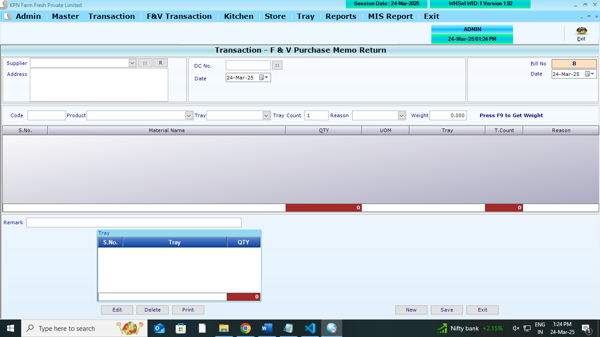
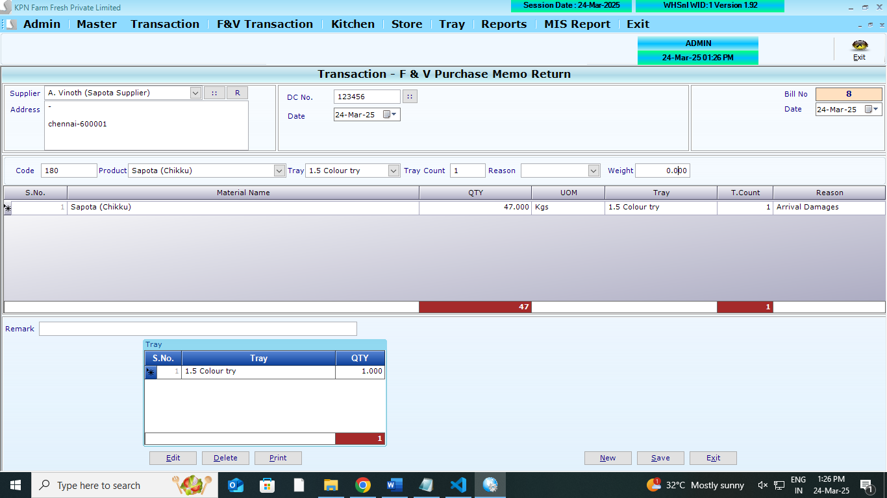
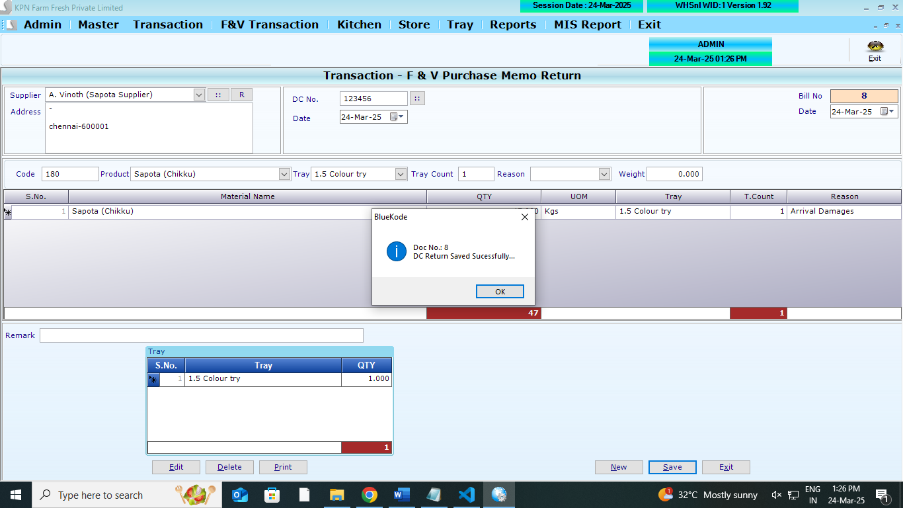

## Main Tables

```
CREATE TABLE [dbo].[DCRetHdr](
	[D_id] [int] NULL,
	[D_Year] [int] NULL,
	[D_Date] [datetime] NULL,
	[D_Suppid] [int] NULL,
	[D_Dcno] [int] NULL,
	[D_Refno] [varchar](100) NULL,
	[D_Dcdate] [datetime] NULL,
	[D_UID] [int] NULL,
	[D_MUID] [int] NULL,
	[D_comid] [int] NULL,
	[D_TotTray] [int] NULL,
	[D_Remarks] [varchar](500) NULL
) ON [PRIMARY]
GO
```

```
CREATE TABLE [dbo].[DCRetDtl](
	[DD_id] [int] NULL,
	[DD_Year] [int] NULL,
	[DD_date] [datetime] NULL,
	[DD_slno] [int] NULL,
	[DD_Prdid] [int] NULL,
	[DD_Batchno] [varchar](100) NULL,
	[DD_Expdate] [datetime] NULL,
	[DD_Qty] [numeric](9, 2) NULL,
	[DD_QtyAct] [numeric](9, 2) NULL,
	[DD_Free] [numeric](9, 2) NULL,
	[DD_FreeAct] [numeric](9, 2) NULL,
	[DD_Rate] [numeric](9, 2) NULL,
	[DD_amt] [numeric](9, 2) NULL,
	[DD_Comid] [int] NULL,
	[DD_Suppid] [int] NULL,
	[DD_Reason] [int] NULL,
	[DD_Trayid] [int] NULL,
	[DD_Traycount] [int] NULL
) ON [PRIMARY]
GO
```

```
CREATE TABLE [dbo].[PurchaseTryRetDtl](
	[PT_Id] [int] NULL,
	[PT_Year] [int] NULL,
	[PT_Date] [datetime] NULL,
	[PT_Slno] [int] NULL,
	[PT_Trayid] [int] NULL,
	[PT_Qty] [int] NULL,
	[PT_comid] [int] NULL
) ON [PRIMARY]
GO
```

## Affted Tables

```
CREATE TABLE [dbo].[StockLedger](
	[SL_Date] [datetime] NULL,
	[SL_items] [int] NULL,
	[SL_batchno] [nvarchar](20) NULL,
	[SL_expdate] [nvarchar](20) NULL,
	[SL_PurQty] [decimal](18, 3) NULL,
	[SL_SalQty] [decimal](18, 3) NULL,
	[SL_WastQty] [decimal](18, 3) NULL,
	[SL_SalRetQty] [decimal](18, 3) NULL,
	[SL_PurRetQty] [decimal](18, 3) NULL,
	[SL_UID] [int] NULL,
	[SL_MUID] [int] NULL,
	[SL_ComId] [int] NULL,
	[SL_StkCorrQty] [numeric](10, 3) NULL,
	[SL_StkcorrFlag] [int] NULL,
	[SL_SCDate] [date] NULL,
	[SL_SCUid] [int] NULL,
	[SL_DCRetQty] [numeric](9, 3) NULL,
	[SL_Closing] [numeric](18, 3) NULL,
	[SL_MultiUnit] [int] NULL
) ON [PRIMARY]
GO
```

```
CREATE TABLE [dbo].[Trayledger](
	[Tl_Date] [datetime] NULL,
	[TL_CustId] [int] NULL,
	[TL_RecQty] [int] NULL,
	[TL_IssQty] [int] NULL,
	[TL_TrayID] [int] NULL,
	[TL_WasteQty] [int] NULL,
	[TL_Opening] [int] NULL,
	[TL_Balance] [int] NULL,
	[TL_ComId] [int] NULL,
	[TL_Year] [int] NULL,
	[TL_Type] [int] NULL
) ON [PRIMARY]
GO
```

```
ProductMaster
```

## REFERANCE SCREENS

**Purchase Memo return opening screen**



**Purchase Memo return entry screen**



**Purchase Memo return save screen**



## LOGICs

1. **Memeo Selection**: List out all memos/Dcs by click view
2. By slecting any DC . FIll all the item against Memo.
3. Then they measure the weight item wise
4. Then they fill the weight in the DC
5. Tray selection also happens here.
6. data posted table-

   - DCRetHdr
   - DCRetDtl
   - PurchaseTryRetDtl
   - StockLedger
     - if SL_DCRetQty exsists , then it will be added to SL_DCRetQty
     - if TL_IssQty exsists , then it will be added to TL_IssQty
     - Rule: per day against one product row should be there in StockLedger
     - SL_DCRetQty `if no record ,insert  against date. if there is record update the SL_DCRetQty against date`
   - Trayledger
     - Rule: per day against one product row should be there in Trayledger
     - TL_IssQty `if no record, insert  against date. if there is record update the TL_IssQty against date`

7. reason for posting: DC Return (Reason master to be provided)

## Ref Queries

- select \* from [dbo].[DCRetHdr]
- select \* from [dbo].[DCRetDtl]
- select \* from [dbo].[StockLedger]
- select \* from [dbo].[Trayledger]
