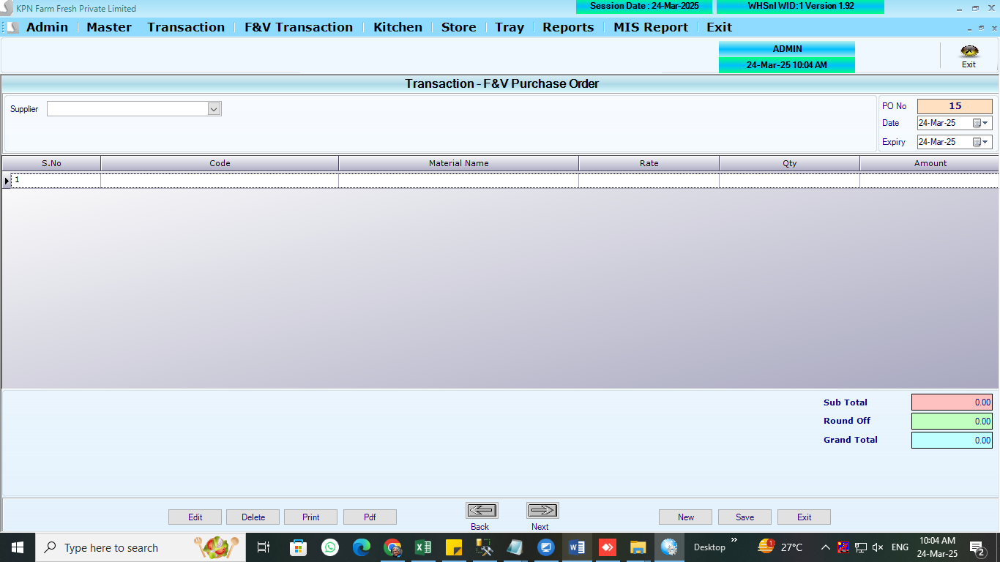
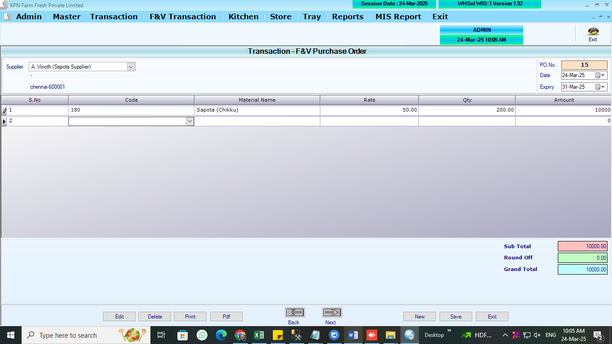
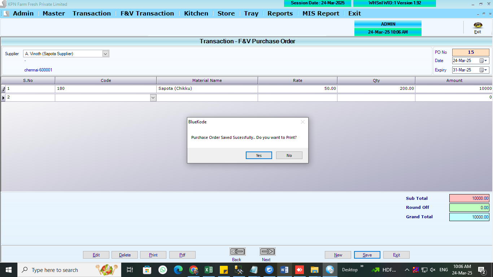

# Purchase Orders

## Table used:

1. PurchorderHdr
   ```
   CREATE TABLE [dbo].[PurchorderFVHdr](
   	[PO_ID] [int] NULL,
   	[PO_Year] [int] NULL,
   	[PO_Date] [datetime] NULL,
   	[PO_SuppId] [int] NULL,
   	[PO_InvNo] [varchar](50) NULL,
   	[PO_InvDt] [datetime] NULL,
   	[PO_Expiry] [datetime] NULL,
   	[PO_Status] [int] NULL,
   	[PO_UID] [int] NULL,
   	[PO_MUID] [int] NULL,
   	[PO_ComId] [int] NULL,
   	[PO_subTot] [numeric](10, 2) NULL,
   	[PO_GSTAmt] [numeric](10, 2) NULL,
   	[PO_Roff] [numeric](10, 2) NULL,
   	[PO_Gtot] [numeric](10, 2) NULL,
   	[PO_CessAmt] [numeric](10, 2) NULL,
   	[PO_MBQRefNo] [int] NULL,
   	[PO_GRN] [int] NULL,
   	[PO_MStatus] [int] NULL,
   	[PO_Auto] [int] NULL,
   	[PO_PORefno] [int] NULL,
   	[PO_time] [datetime] NULL,
   	[PO_Amendment] [int] NOT NULL
   ) ON [PRIMARY]
   GO
   ```
2. PurchorderDtl

```
CREATE TABLE [dbo].[PurchorderFVDtl](
	[POD_ID] [int] NULL,
	[POD_Year] [int] NULL,
	[POD_Date] [datetime] NULL,
	[POD_Slno] [int] NULL,
	[POD_Prdid] [int] NULL,
	[POD_Stkhold] [decimal](10, 2) NULL,
	[POD_Balance] [decimal](10, 2) NULL,
	[POD_MRP] [decimal](10, 2) NULL,
	[POD_PurRate] [decimal](18, 0) NULL,
	[POD_GST] [decimal](10, 2) NULL,
	[POD_Rate] [decimal](10, 2) NULL,
	[POD_Qty] [decimal](10, 2) NULL,
	[POD_Amt] [decimal](10, 2) NULL,
	[POD_ComId] [int] NULL,
	[POD_SuppID] [int] NULL,
	[POD_RecQty] [numeric](10, 2) NULL,
	[POD_GSTAmt] [numeric](10, 2) NULL,
	[POD_CGST] [numeric](10, 2) NULL,
	[POD_SGST] [numeric](10, 2) NULL,
	[POD_CSS] [numeric](10, 2) NULL,
	[POD_CessAmt] [numeric](10, 2) NULL,
	[POD_CaseQty] [int] NULL,
	[POD_orderQty] [decimal](10, 2) NULL,
	[POD_Cushion] [decimal](10, 2) NULL
) ON [PRIMARY]
GO
```

## REFERANCE SCREENS

**PO opening screen**


**PO entry screen**


**PO saving screen**



## LOGICs

-- For FV MRP,GST not applicable

1. List out all the products againt supplier by sleecting supplier
2. Po expiry to be selected - date
3. Po date to be selected - date
4. Mrp should not show in screen for FV
5. Rate can be editable
6. Excel Import option - prod_code, qty in excel column. that should be populated in screen. remaing proceed with exsting logic in screen
7. PO print out to be done.
