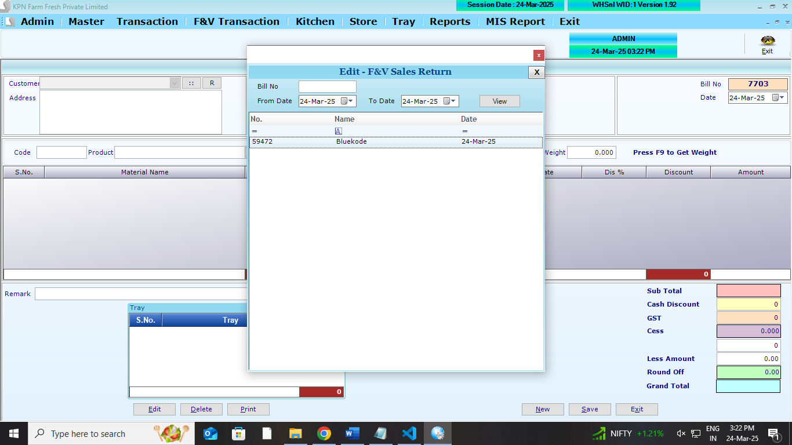
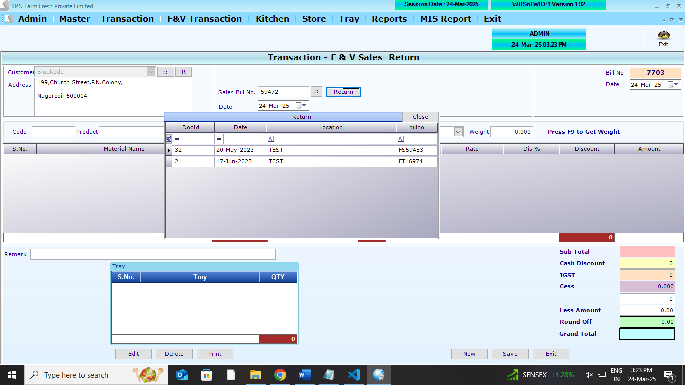
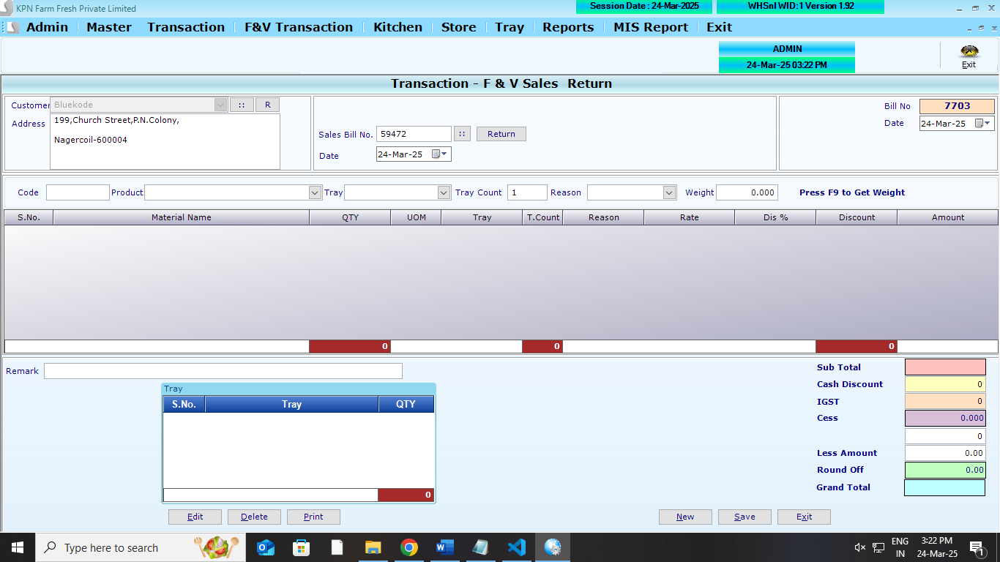
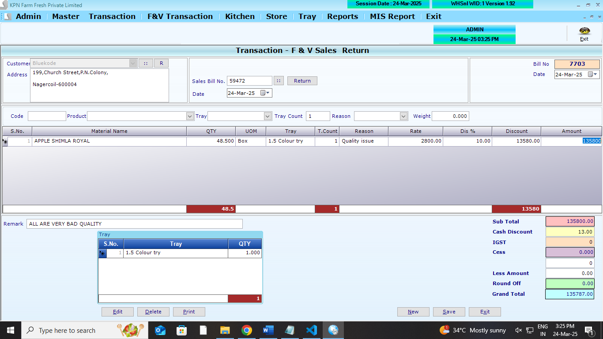
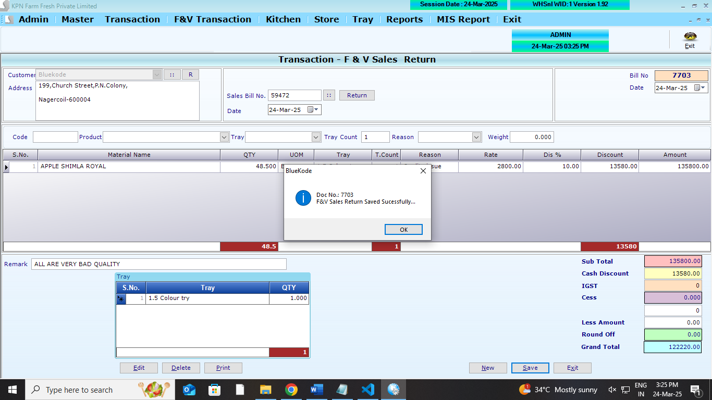

## Main Tables

```
CREATE TABLE [dbo].[salFVrethdr](
	[SR_ID] [int] NULL,
	[SR_Year] [int] NULL,
	[SR_Date] [datetime] NULL,
	[SR_CustId] [int] NULL,
	[SR_Tot] [numeric](9, 2) NULL,
	[SR_Discount] [numeric](9, 2) NULL,
	[SR_VatCstAmt] [numeric](9, 2) NULL,
	[SR_GTot] [numeric](9, 2) NULL,
	[SR_InvNo] [varchar](50) NULL,
	[SR_SalesDocId] [int] NULL,
	[SR_UID] [int] NULL,
	[SR_MUID] [int] NULL,
	[SR_RoundOff] [numeric](9, 2) NULL,
	[SR_ComId] [int] NULL,
	[SR_Type] [int] NULL,
	[SR_AppFlag] [int] NULL,
	[SR_CessAmt] [numeric](9, 2) NULL,
	[SR_SalType] [int] NULL,
	[SR_GSTorIGST] [int] NULL,
	[SR_Remark] [varchar](100) NULL,
	[SR_Verifyid] [int] NULL
) ON [PRIMARY]
GO
```

```
CREATE TABLE [dbo].[salFVretdtl](
	[SRD_ID] [int] NULL,
	[SRD_Year] [int] NULL,
	[SRD_Date] [datetime] NULL,
	[SRD_Slno] [int] NULL,
	[SRD_Prdid] [int] NULL,
	[SRD_batchno] [varchar](50) NULL,
	[SRD_expdate] [varchar](50) NULL,
	[SRD_ActQty] [numeric](9, 3) NULL,
	[SRD_Qty] [numeric](9, 3) NULL,
	[SRD_ActFree] [numeric](9, 3) NULL,
	[SRD_Free] [numeric](9, 3) NULL,
	[SRD_Dis] [numeric](9, 2) NULL,
	[SRD_DisAmt] [numeric](9, 2) NULL,
	[SRD_Vat] [numeric](9, 2) NULL,
	[SRD_VatAmt] [numeric](9, 2) NULL,
	[SRD_Rate] [numeric](9, 2) NULL,
	[SRD_Amt] [numeric](9, 2) NULL,
	[SRD_ComId] [int] NULL,
	[SRD_SuppID] [int] NULL,
	[SRD_Reason] [int] NULL,
	[SRD_CGST] [numeric](9, 2) NULL,
	[SRD_SGST] [numeric](9, 2) NULL,
	[SRD_Cess] [numeric](9, 2) NULL,
	[SRD_CessAmt] [numeric](9, 2) NULL,
	[SRD_SalType] [int] NULL,
	[SRD_MRP] [numeric](9, 2) NULL,
	[SRD_Tray] [int] NULL,
	[SRD_Traycount] [int] NULL
) ON [PRIMARY]
GO
```

```
CREATE TABLE [dbo].[SalesTryRetDtl](
	[PT_Id] [int] NULL,
	[PT_Year] [int] NULL,
	[PT_Date] [datetime] NULL,
	[PT_Slno] [int] NULL,
	[PT_Trayid] [int] NULL,
	[PT_Qty] [int] NULL,
	[PT_comid] [int] NULL
) ON [PRIMARY]
GO

```

## Affected Table

```
CREATE TABLE [dbo].[Partyledger](
	[PL_id] [int] NULL,
	[PL_Did] [int] NULL,
	[PL_Date] [datetime] NULL,
	[PL_Type] [nvarchar](2) NULL,
	[PL_No] [int] NULL,
	[PL_Mode] [int] NULL,
	[PL_Chequeno] [nvarchar](15) NULL,
	[PL_Cdate] [datetime] NULL,
	[PL_Credit] [decimal](18, 2) NULL,
	[PL_Debit] [decimal](18, 2) NULL,
	[PL_Remarks] [nvarchar](max) NULL,
	[PL_PtTyp] [nvarchar](5) NULL,
	[PL_ComId] [int] NULL
) ON [PRIMARY] TEXTIMAGE_ON [PRIMARY]
GO
```

```
CREATE TABLE [dbo].[store_return](
	[outletId] [int] NULL,
	[docid] [int] NULL,
	[docdate] [datetime] NULL,
	[billtype] [int] NULL,
	[billno] [varchar](100) NULL,
	[billdate] [varchar](12) NULL,
	[srid] [int] NULL,
	[prod_code] [varchar](20) NULL,
	[send_qty] [numeric](12, 3) NULL,
	[recd_qty] [numeric](12, 3) NULL,
	[reason] [varchar](200) NULL,
	[reason1] [varchar](200) NULL,
	[flag] [int] NULL,
	[status] [int] NULL,
	[WHStock] [numeric](12, 3) NULL,
	[DnE] [numeric](12, 3) NULL,
	[verifydate] [datetime] NULL,
	[verifyUser] [int] NULL,
	[RejectQty] [numeric](12, 3) NULL,
	[Rjt_Reason] [varchar](100) NULL,
	[batchno] [nvarchar](40) NOT NULL,
	[expdate] [nvarchar](40) NOT NULL,
	[Wid] [int] NULL
) ON [PRIMARY]
GO
```

```
CREATE TABLE [dbo].[StockLedger](
	[SL_Date] [datetime] NULL,
	[SL_items] [int] NULL,
	[SL_batchno] [nvarchar](20) NULL,
	[SL_expdate] [nvarchar](20) NULL,
	[SL_PurQty] [decimal](18, 3) NULL,
	[SL_SalQty] [decimal](18, 3) NULL,
	[SL_WastQty] [decimal](18, 3) NULL,
	[SL_SalRetQty] [decimal](18, 3) NULL,
	[SL_PurRetQty] [decimal](18, 3) NULL,
	[SL_UID] [int] NULL,
	[SL_MUID] [int] NULL,
	[SL_ComId] [int] NULL,
	[SL_StkCorrQty] [numeric](10, 3) NULL,
	[SL_StkcorrFlag] [int] NULL,
	[SL_SCDate] [date] NULL,
	[SL_SCUid] [int] NULL,
	[SL_DCRetQty] [numeric](9, 3) NULL,
	[SL_Closing] [numeric](18, 3) NULL,
	[SL_MultiUnit] [int] NULL
) ON [PRIMARY]
GO
```

## REFERANCE SCREENS

**Salesreturn opening screen**


**Salesreturn opening edit screen**



**Salesreturn opening screen**



**Salesreturn entry screen**



**Salesreturn entry screen**



**Salesreturn save screen**




1.  All Screen logics are to done . refer screens

## FEATURES REQUIRED

## LOGICS

- **Type selection** - Direct ,Billwise,Return Verify
- **Direct** return happens (return logic is there)
- **Billwise** - by slect the bills - individual item wise
- **Return verification** - return doc no to be listed need to list the accepted items in return verification (return logic is there) - store_retun table `status` is updated to 1
- StockLedger Logic `SL_SalRetQty`
- Partyledger
- **Rule 1**: If any item is not present in the partyledger, then it will be added
- if PL_Credit exsists , then it will be added to PL_Credit .
  - `PL_Credit`
  - `PL_Type` to be `SR` for Sales return
  - `PL_No` - this Doc number (`SR_ID`)
  - `PL_Mode` - `0` to be posted
  - `PL_Chequeno` - `empty` to be posted
  - `PL_Cdate` - `doc date` to be posted
  - `PL_Credit` - `0` to be posted
  - `PL_Remarks` - `Sales Return no (SR_ID)` to be posted
  - `PL_PtTyp` - `C` to be posted
  - `PL_ComId` - `company_id` to be posted
