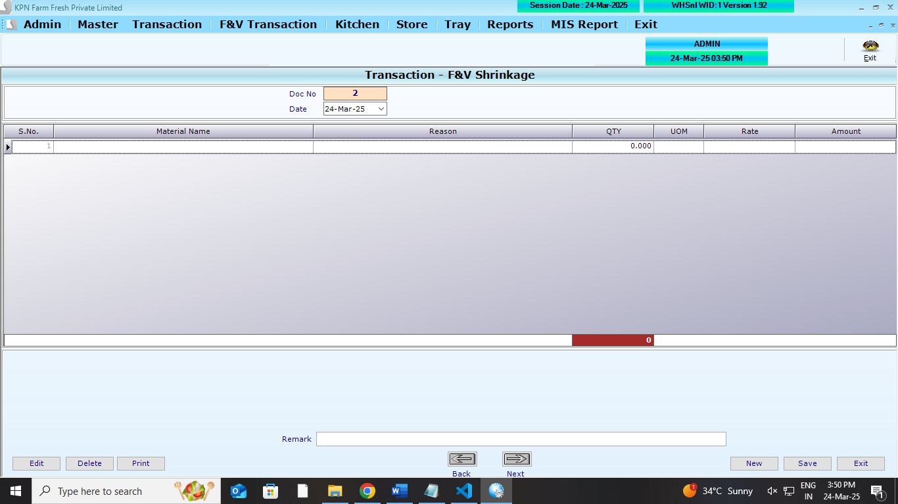
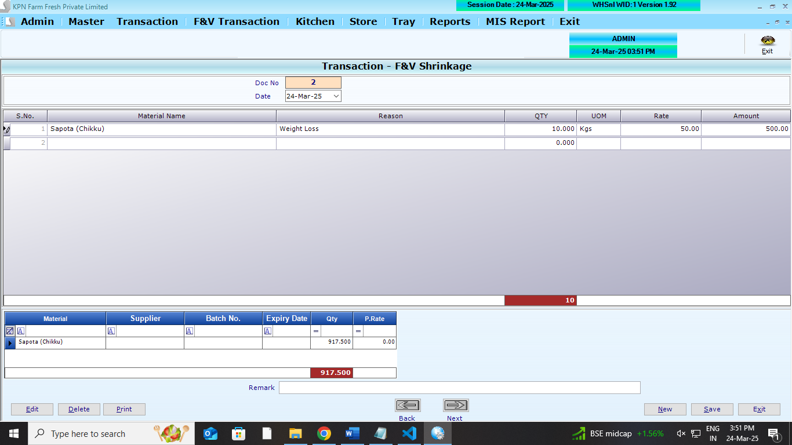
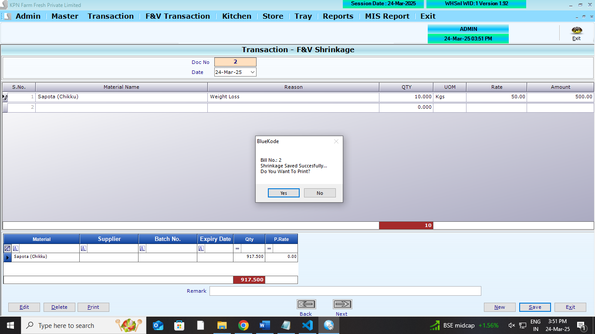

## Main Table

```
CREATE TABLE [dbo].[FVShrinkageHdr](
	[W_ID] [int] NULL,
	[W_Year] [int] NULL,
	[W_Date] [datetime] NULL,
	[W_Tot] [numeric](18, 0) NULL,
	[W_VatCstAmt] [numeric](10, 2) NULL,
	[W_GTot] [numeric](10, 2) NULL,
	[W_UID] [int] NULL,
	[W_MUID] [int] NULL,
	[W_RoundOff] [numeric](10, 2) NULL,
	[W_ComId] [int] NULL,
	[W_PGTot] [numeric](10, 2) NULL,
	[W_Others] [numeric](10, 2) NULL,
	[W_DelStat] [int] NULL,
	[W_Remark] [varchar](1000) NULL
) ON [PRIMARY]
GO
```

```
CREATE TABLE [dbo].[FVShrinkageDtl](
	[WD_ID] [int] NULL,
	[WD_Year] [int] NULL,
	[WD_Date] [datetime] NULL,
	[WD_Slno] [int] NULL,
	[WD_Prdid] [int] NULL,
	[WD_batchno] [nvarchar](100) NULL,
	[WD_expdate] [nvarchar](50) NULL,
	[WD_Qty] [decimal](10, 2) NULL,
	[WD_Dis] [decimal](10, 2) NULL,
	[WD_DisAmt] [decimal](10, 2) NULL,
	[WD_Vat] [decimal](10, 2) NULL,
	[WD_VatAmt] [decimal](10, 2) NULL,
	[WD_Rate] [decimal](10, 2) NULL,
	[WD_Amt] [decimal](10, 2) NULL,
	[WD_ComId] [int] NULL,
	[WD_PRate] [float] NULL,
	[WD_PAmt] [float] NULL,
	[WD_SuppID] [int] NULL,
	[WD_Reason] [varchar](1000) NULL
) ON [PRIMARY]
GO
```

## Affted Table

```
CREATE TABLE [dbo].[StockLedger](
	[SL_Date] [datetime] NULL,
	[SL_items] [int] NULL,
	[SL_batchno] [nvarchar](20) NULL,
	[SL_expdate] [nvarchar](20) NULL,
	[SL_PurQty] [decimal](18, 3) NULL,
	[SL_SalQty] [decimal](18, 3) NULL,
	[SL_WastQty] [decimal](18, 3) NULL,
	[SL_SalRetQty] [decimal](18, 3) NULL,
	[SL_PurRetQty] [decimal](18, 3) NULL,
	[SL_UID] [int] NULL,
	[SL_MUID] [int] NULL,
	[SL_ComId] [int] NULL,
	[SL_StkCorrQty] [numeric](10, 3) NULL,
	[SL_StkcorrFlag] [int] NULL,
	[SL_SCDate] [date] NULL,
	[SL_SCUid] [int] NULL,
	[SL_DCRetQty] [numeric](9, 3) NULL,
	[SL_Closing] [numeric](18, 3) NULL,
	[SL_MultiUnit] [int] NULL
) ON [PRIMARY]
GO
```

## REFERANCE SCREENS

**Shrinkage opening screen**



## REFERANCE SCREENS

**Shrinkage entry screen**



## REFERANCE SCREENS

**Shrinkage save screen**



## Logics

1. When product enter, need to fill reason
2. rate - `purchase rate of the product master`
3. **Stock ledger** - `SL_WastQty = SL_WastQty+ WD_Qty`
