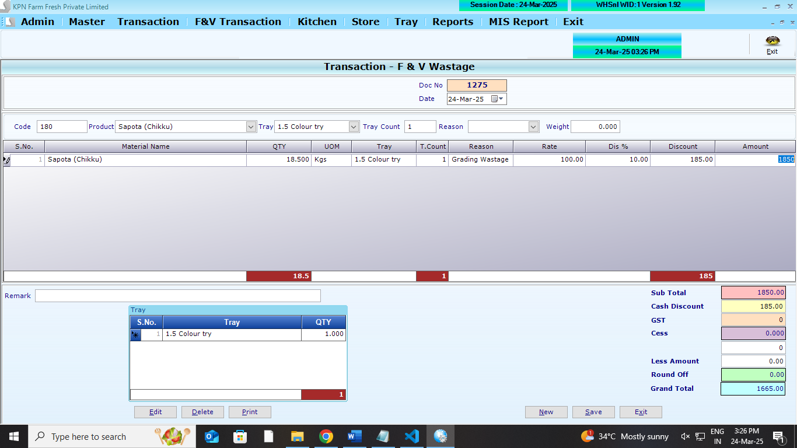
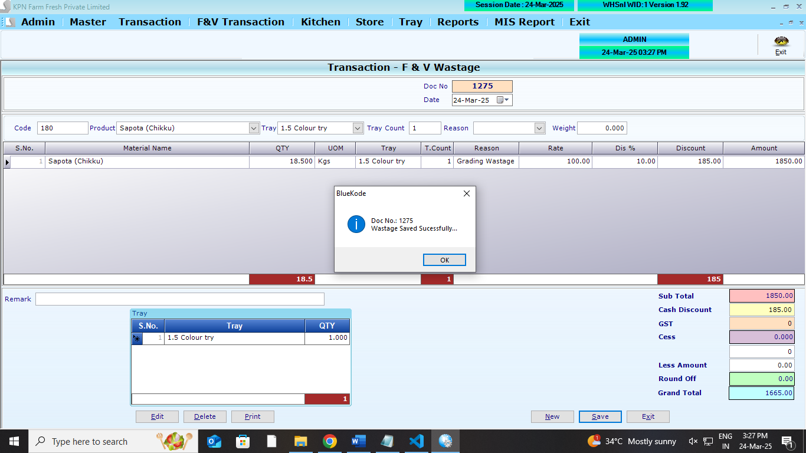

## Main Table

```
CREATE TABLE [dbo].[FVWastagehdr](
	[W_ID] [int] NULL,
	[W_Year] [int] NULL,
	[W_Date] [datetime] NULL,
	[W_Tot] [numeric](9, 2) NULL,
	[W_VatCstAmt] [numeric](9, 2) NULL,
	[W_GTot] [numeric](9, 2) NULL,
	[W_UID] [int] NULL,
	[W_MUID] [int] NULL,
	[W_RoundOff] [numeric](9, 2) NULL,
	[W_ComId] [int] NULL,
	[W_PGTot] [numeric](9, 2) NULL,
	[W_Others] [numeric](9, 2) NULL,
	[W_DelStat] [int] NULL,
	[W_Remark] [varchar](200) NULL
) ON [PRIMARY]
GO
```

```
CREATE TABLE [dbo].[FVWastagedtl](
	[WD_ID] [int] NULL,
	[WD_Year] [int] NULL,
	[WD_Date] [datetime] NULL,
	[WD_Slno] [int] NULL,
	[WD_Prdid] [int] NULL,
	[WD_batchno] [nvarchar](200) NULL,
	[WD_expdate] [nvarchar](100) NULL,
	[WD_Qty] [numeric](9, 2) NULL,
	[WD_Dis] [numeric](9, 2) NULL,
	[WD_DisAmt] [numeric](9, 2) NULL,
	[WD_Vat] [numeric](9, 2) NULL,
	[WD_VatAmt] [numeric](9, 2) NULL,
	[WD_Rate] [numeric](9, 2) NULL,
	[WD_Amt] [numeric](9, 2) NULL,
	[WD_ComId] [int] NULL,
	[WD_PRate] [numeric](9, 2) NULL,
	[WD_PAmt] [numeric](9, 2) NULL,
	[WD_SuppID] [int] NULL,
	[WD_Reason] [int] NULL,
	[WD_Tray] [int] NULL,
	[WD_Traycount] [int] NULL
) ON [PRIMARY]
GO
```

```
CREATE TABLE [dbo].[FVwastagetryDtl](
	[WT_id] [int] NULL,
	[WT_year] [int] NULL,
	[WT_Date] [datetime] NULL,
	[WT_slno] [int] NULL,
	[WT_Trayid] [int] NULL,
	[WT_Qty] [int] NULL,
	[WT_Comid] [int] NULL
) ON [PRIMARY]
GO

```

## Affted Table

```
CREATE TABLE [dbo].[StockLedger](
	[SL_Date] [datetime] NULL,
	[SL_items] [int] NULL,
	[SL_batchno] [nvarchar](20) NULL,
	[SL_expdate] [nvarchar](20) NULL,
	[SL_PurQty] [decimal](18, 3) NULL,
	[SL_SalQty] [decimal](18, 3) NULL,
	[SL_WastQty] [decimal](18, 3) NULL,
	[SL_SalRetQty] [decimal](18, 3) NULL,
	[SL_PurRetQty] [decimal](18, 3) NULL,
	[SL_UID] [int] NULL,
	[SL_MUID] [int] NULL,
	[SL_ComId] [int] NULL,
	[SL_StkCorrQty] [numeric](10, 3) NULL,
	[SL_StkcorrFlag] [int] NULL,
	[SL_SCDate] [date] NULL,
	[SL_SCUid] [int] NULL,
	[SL_DCRetQty] [numeric](9, 3) NULL,
	[SL_Closing] [numeric](18, 3) NULL,
	[SL_MultiUnit] [int] NULL
) ON [PRIMARY]
GO
```

```
CREATE TABLE [dbo].[Trayledger](
	[Tl_Date] [datetime] NULL,
	[TL_CustId] [int] NULL,
	[TL_RecQty] [int] NULL,
	[TL_IssQty] [int] NULL,
	[TL_TrayID] [int] NULL,
	[TL_WasteQty] [int] NULL,
	[TL_Opening] [int] NULL,
	[TL_Balance] [int] NULL,
	[TL_ComId] [int] NULL,
	[TL_Year] [int] NULL,
	[TL_Type] [int] NULL
) ON [PRIMARY]
GO
```

## REFERANCE SCREENS

**Wastage opening screen**


**Wastage entry screen**



**Wastage save screen**



## Logics

1. When product enter, need to fill reason
2. WH less to be filled (atleast any one) `Qty= WHless+ D&E `
3. rate - `purchase rate of the product master`
4. **Stock ledger** - `SL_WastQty = SL_WastQty+ WD_Qty`
5. **DnEStockLedger** - `DL_Inward = DL_Inward+ WD_DnE`
<!-- 5. **Trayledger** - `TL_WasteQty = TL_WasteQty+ WT_Qty` -->
