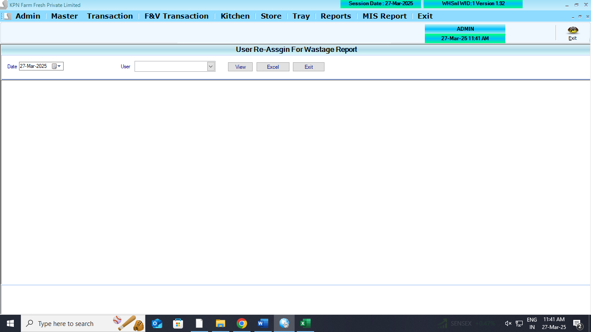
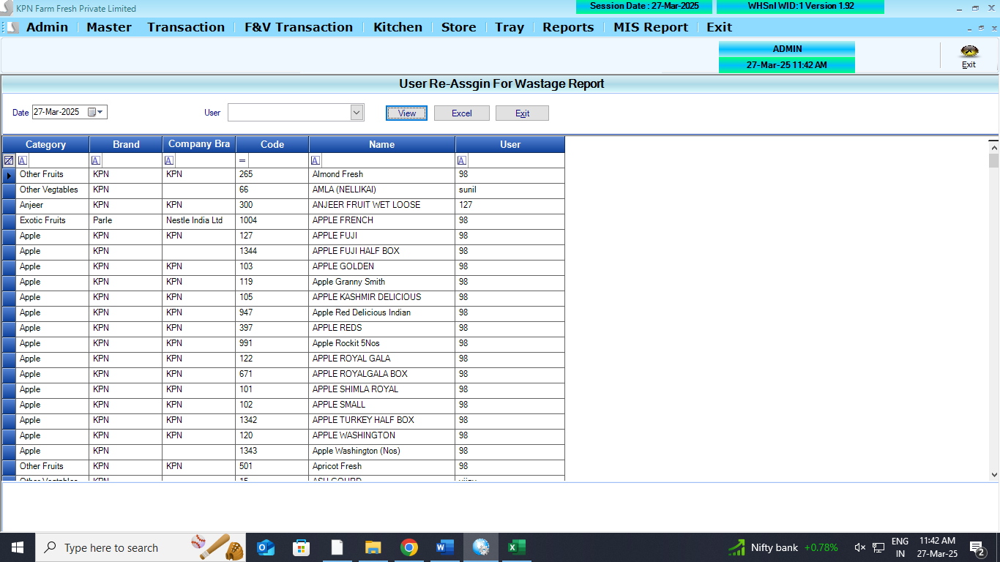
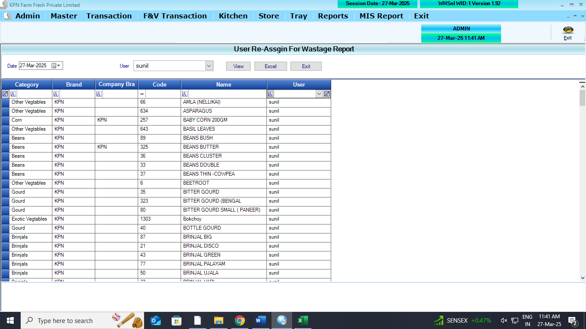

## Main Table

```
CREATE TABLE [dbo].[ReAssignWastageUser](
	[RAWU_PrdID] [int] NULL,
	[RAWU_UserID] [int] NULL,
	[RAWU_ComID] [int] NULL,
	[RAWU_Startdate] [datetime] NULL,
	[RAWU_Enddate] [datetime] NULL
) ON [PRIMARY]
GO
```

## Affected Table

## REFERANCE SCREENS

**User Assign wastage report opening screen**



**User Assign wastage report view screen**



**User Assign wastage report view screen**




## Logics

- assigin the user to the product. per product has single user
- **Featured Required** - Excel import
