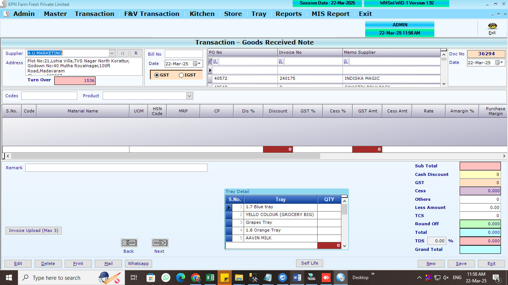

## Main Tables

```
CREATE TABLE [dbo].[PurchaseHdr](
	[P_ID] [int] NULL,
	[P_Year] [int] NULL,
	[P_Date] [datetime] NULL,
	[P_SuppId] [int] NULL,
	[P_Tot] [numeric](10, 3) NULL,
	[P_Discount] [numeric](10, 3) NULL,
	[P_VatCstAmt] [numeric](10, 3) NULL,
	[P_GTot] [numeric](10, 3) NULL,
	[P_InvNo] [nvarchar](30) NULL,
	[P_UID] [int] NULL,
	[P_MUID] [int] NULL,
	[P_RoundOff] [numeric](10, 3) NULL,
	[P_Paid] [numeric](10, 3) NULL,
	[P_PayStat] [int] NULL,
	[P_RetAmt] [numeric](10, 3) NULL,
	[P_ComId] [int] NULL,
	[P_InvDt] [datetime] NULL,
	[P_Others] [numeric](10, 3) NULL,
	[P_GSTorIGST] [numeric](10, 3) NULL,
	[P_Advance] [numeric](10, 3) NULL,
	[P_CessAmt] [numeric](10, 2) NULL,
	[P_Remark] [varchar](200) NULL,
	[P_LessAmt] [numeric](10, 2) NULL,
	[P_FVType] [int] NULL,
	[P_Tcs] [numeric](18, 3) NULL,
	[P_DCNo] [varchar](100) NULL,
	[P_closingStock] [numeric](18, 2) NOT NULL,
	[P_Sales] [numeric](18, 2) NOT NULL,
	[P_salesreturn] [numeric](18, 2) NOT NULL,
	[P_openingstock] [numeric](18, 2) NOT NULL,
	[P_purchase] [numeric](18, 2) NOT NULL,
	[P_purchasereturn] [numeric](18, 2) NOT NULL,
	[P_debitnote] [numeric](18, 2) NOT NULL,
	[P_profit] [numeric](18, 2) NOT NULL,
	[P_Per] [numeric](18, 2) NOT NULL,
	[P_averageagreedmargin] [numeric](18, 2) NOT NULL,
	[P_averagefillrate] [numeric](18, 2) NOT NULL,
	[P_TDSPer] [numeric](18, 2) NOT NULL,
	[P_TDSAmt] [numeric](18, 2) NOT NULL,
	[P_Time] [datetime] NULL,
	[P_ReasonDN] [varchar](500) NOT NULL,
	[P_ReasonDNAmt] [decimal](18, 2) NOT NULL,
	[P_DNAmt] [decimal](18, 2) NOT NULL,
 CONSTRAINT [UK_PurchaseHdr] UNIQUE NONCLUSTERED
(
	[P_ID] ASC,
	[P_Date] ASC,
	[P_ComId] ASC,
	[P_Year] ASC
)WITH (PAD_INDEX = OFF, STATISTICS_NORECOMPUTE = OFF, IGNORE_DUP_KEY = OFF, ALLOW_ROW_LOCKS = ON, ALLOW_PAGE_LOCKS = ON, FILLFACTOR = 80, OPTIMIZE_FOR_SEQUENTIAL_KEY = OFF) ON [PRIMARY]
) ON [PRIMARY]
GO
```

```
CREATE TABLE [dbo].[PurchaseDtl](
	[PD_ID] [int] NULL,
	[PD_Year] [int] NULL,
	[PD_Date] [datetime] NULL,
	[PD_Slno] [int] NULL,
	[PD_Prdid] [int] NULL,
	[PD_batchno] [nvarchar](20) NULL,
	[PD_expdate] [nvarchar](20) NULL,
	[PD_Qty] [decimal](18, 3) NULL,
	[PD_Free] [decimal](18, 3) NULL,
	[PD_Dis] [decimal](18, 2) NULL,
	[PD_DisAmt] [numeric](10, 3) NULL,
	[PD_Vat] [decimal](18, 2) NULL,
	[PD_VatAmt] [numeric](10, 3) NULL,
	[PD_Rate] [numeric](10, 3) NULL,
	[PD_Amt] [numeric](10, 3) NULL,
	[PD_ComId] [int] NULL,
	[PD_SuppID] [int] NULL,
	[PD_PONO] [int] NULL,
	[pd_AMargin] [numeric](10, 2) NULL,
	[PD_SalRate] [numeric](10, 2) NULL,
	[PD_MRP] [numeric](10, 2) NULL,
	[PD_CGST] [numeric](10, 2) NULL,
	[PD_SGST] [numeric](10, 2) NULL,
	[PD_CSS] [numeric](10, 2) NULL,
	[PD_CessAmt] [numeric](10, 2) NULL,
	[PD_POQty] [numeric](18, 3) NULL,
	[PD_Packflag] [int] NULL,
	[PD_Packqty] [numeric](9, 3) NULL,
	[PD_WHMargin] [numeric](18, 2) NULL,
	[PD_SalesMargin] [numeric](18, 2) NULL,
	[PD_ReasonDNAmt] [decimal](18, 2) NOT NULL,
	[PD_DNAmt] [decimal](18, 2) NOT NULL,
	[PD_RetQty] [numeric](18, 3) NULL
) ON [PRIMARY]
GO
```

```
CREATE TABLE [dbo].[Partyledger](
	[PL_id] [int] NULL,
	[PL_Did] [int] NULL,
	[PL_Date] [datetime] NULL,
	[PL_Type] [nvarchar](2) NULL,
	[PL_No] [int] NULL,
	[PL_Mode] [int] NULL,
	[PL_Chequeno] [nvarchar](15) NULL,
	[PL_Cdate] [datetime] NULL,
	[PL_Credit] [decimal](18, 2) NULL,
	[PL_Debit] [decimal](18, 2) NULL,
	[PL_Remarks] [nvarchar](max) NULL,
	[PL_PtTyp] [nvarchar](5) NULL,
	[PL_ComId] [int] NULL
) ON [PRIMARY] TEXTIMAGE_ON [PRIMARY]
GO
```

## Affected Tables

```
CREATE TABLE [dbo].[PurBatchDtl](
	[PB_PurId] [int] NULL,
	[PB_Date] [datetime] NULL,
	[PB_Prdid] [int] NULL,
	[PB_batchno] [nvarchar](20) NULL,
	[PB_expdate] [nvarchar](20) NULL,
	[PB_Qty] [decimal](18, 3) NULL,
	[PD_Year] [int] NULL,
	[PD_ComId] [int] NULL,
	[PB_Mnfdate] [datetime] NULL,
	[PB_ExpMonth] [int] NULL,
	[PB_MnthDay] [int] NULL
) ON [PRIMARY]
GO
```

```
CREATE TABLE [dbo].[GRNImages](
	[GI_ID] [int] NOT NULL,
	[GI_Year] [int] NOT NULL,
	[GI_ComId] [int] NOT NULL,
	[GI_ImageNo] [int] NOT NULL,
	[GI_ImageData] [image] NULL
) ON [PRIMARY] TEXTIMAGE_ON [PRIMARY]
GO
```

```
Product Master
```

```
CREATE TABLE [dbo].[PurchaseMemoHdr](
	[PM_ID] [int] NULL,
	[PM_Year] [int] NULL,
	[PM_Date] [datetime] NULL,
	[PM_SuppId] [int] NULL,
	[PM_GTot] [numeric](10, 3) NULL,
	[PM_InvNo] [nvarchar](30) NULL,
	[PM_UID] [int] NULL,
	[PM_MUID] [int] NULL,
	[PM_PayStat] [int] NULL,
	[PM_ComId] [int] NULL,
	[PM_InvDt] [datetime] NULL,
	[PM_Remark] [varchar](200) NULL,
	[PM_PO] [varchar](max) NULL,
	[PM_ReturnAmt] [numeric](18, 2) NULL,
	[PM_ReturnRemark] [varchar](200) NULL,
	[PM_Tot] [numeric](10, 3) NULL,
	[PM_Discount] [numeric](10, 3) NULL,
	[PM_VatCstAmt] [numeric](10, 3) NULL,
	[PM_RoundOff] [numeric](10, 3) NULL,
	[PM_Others] [numeric](10, 3) NULL,
	[PM_GSTorIGST] [numeric](10, 3) NULL,
	[PM_Advance] [numeric](10, 3) NULL,
	[PM_CessAmt] [numeric](10, 2) NULL,
	[PM_LessAmt] [numeric](10, 2) NULL,
	[PM_FVType] [int] NULL,
	[PM_Tcs] [numeric](18, 3) NULL,
	[PM_DCNo] [varchar](100) NULL
) ON [PRIMARY] TEXTIMAGE_ON [PRIMARY]
GO
```

```
CREATE TABLE [dbo].[MBQPO](
	[MP_ID] [int] NOT NULL,
	[MP_POID] [int] NOT NULL,
	[MP_Date] [datetime] NOT NULL,
	[MP_Suppid] [int] NOT NULL,
	[MP_Locid] [int] NOT NULL,
	[MP_PrdCode] [bigint] NOT NULL,
	[MP_POQty] [int] NOT NULL,
	[MP_GRNNO] [int] NULL,
	[MP_ToDate] [datetime] NULL,
	[MP_GRNQty] [int] NULL
) ON [PRIMARY]
GO

```

## REFERANCE SCREENS

**PO GRN Opening screen**


**PO GRN entry screen**


**PO GRN entry screen**


**PO GRN save screen**


**PO GRN save screen**


**PO GRN save screen**


**PO GRN save screen**


**PO GRN save screen**


## LOGICs

1. **Memeo Selection**: List out all memos/Dcs where condtion is `PM_PayStat is 0` by click view
2. By slecting any DC . FIll all the item against Memo inside the table
3. If any changes in mrp,discount,gst(%),cess, sales_rate,purchase_rate
4. if Purchase Margin less than Accept margin, need to raise the debit note against the item wise
5. this will happens on after confirmation by the users
6. Partyledger

- ** Rule 1**: If any item is not present in the partyledger, then it will be added
- if PL_Debit exsists , then it will be added to PL_Debit .
  - `PL_Debit`
  - `PL_Type` to be `E` for purchase
  - `PL_No` - this Doc number (`P_ID`)
  - `PL_Mode` - `0` to be posted
  - `PL_Chequeno` - `empty` to be posted
  - `PL_Cdate` - `doc date` to be posted
  - `PL_Credit` - `0` to be posted
  - `PL_Remarks` - `Purchase inv no (party invoice number)` to be posted
  - `PL_PtTyp` - `S` to be posted - (`C` for customer)
  - `PL_ComId` - `company_id` to be posted

7. GRNImages - Add images to the GRN
8. `PM_PayStat` - this Doc number (`P_ID`) in Purchase memo header
9. MBQPO - table to be updated to track overall status (need clarification when develop)
10. mrp,discount,gst(%),cess, sales_rate,purchase_rate to updated in ProductMaster
11. After inserting above into respective tables. need to update `customer/suppliers` table `balance` column
    balance to be updated in supplier master (`exsisiting_balance+new_balance`)
