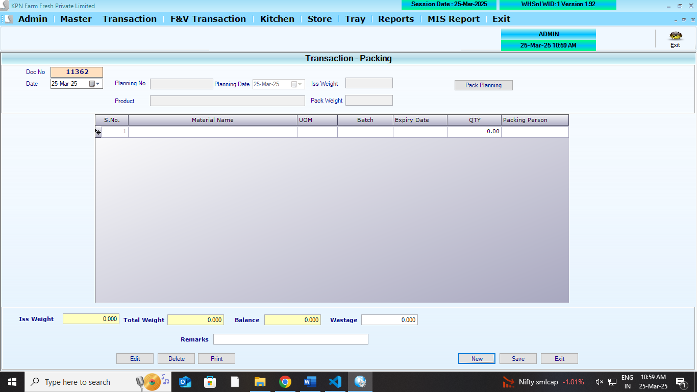
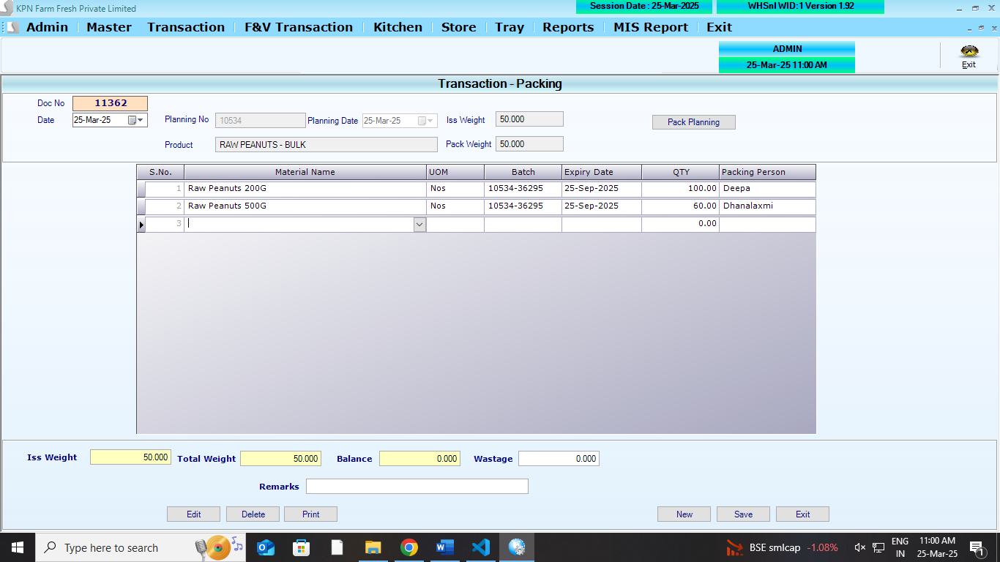
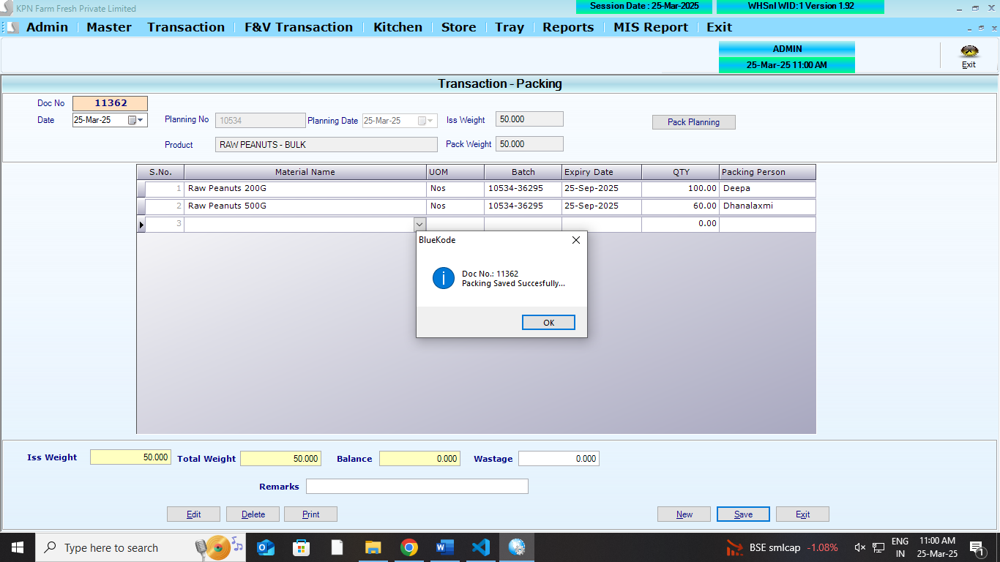

## Main Table

```
CREATE TABLE [dbo].[PackingHdr](
	[PH_Id] [int] NULL,
	[PH_Year] [int] NULL,
	[PH_ComId] [int] NULL,
	[PH_date] [datetime] NULL,
	[PH_UId] [int] NULL,
	[PH_TotWeight] [numeric](9, 3) NULL,
	[PH_BalWeight] [numeric](9, 3) NULL,
	[PH_WasteWeight] [numeric](9, 3) NULL,
	[PH_Remarks] [varchar](200) NULL,
	[PH_BalFlag] [int] NULL,
	[PH_Planid] [int] NULL,
	[PH_PlanPrd] [int] NULL,
	[PH_Planweight] [numeric](9, 3) NULL,
	[PH_PackWeight] [numeric](9, 3) NULL
) ON [PRIMARY]
GO
```

```
CREATE TABLE [dbo].[PackingDtl](
	[PD_Id] [int] NULL,
	[PD_Year] [int] NULL,
	[PD_ComId] [int] NULL,
	[PD_Slno] [int] NULL,
	[PD_ProdId] [int] NULL,
	[PD_Qty] [numeric](10, 2) NULL,
	[PD_Batch] [varchar](50) NULL,
	[PD_Exp_Date] [nvarchar](40) NULL,
	[PD_EmpId] [int] NULL,
	[PD_Packqty] [numeric](9, 3) NULL
) ON [PRIMARY]
GO
```

## Affected Table

```
CREATE TABLE [dbo].[StockLedger](
	[SL_Date] [datetime] NULL,
	[SL_items] [int] NULL,
	[SL_batchno] [nvarchar](20) NULL,
	[SL_expdate] [nvarchar](20) NULL,
	[SL_PurQty] [decimal](18, 3) NULL,
	[SL_SalQty] [decimal](18, 3) NULL,
	[SL_WastQty] [decimal](18, 3) NULL,
	[SL_SalRetQty] [decimal](18, 3) NULL,
	[SL_PurRetQty] [decimal](18, 3) NULL,
	[SL_UID] [int] NULL,
	[SL_MUID] [int] NULL,
	[SL_ComId] [int] NULL,
	[SL_StkCorrQty] [numeric](10, 3) NULL,
	[SL_StkcorrFlag] [int] NULL,
	[SL_SCDate] [date] NULL,
	[SL_SCUid] [int] NULL,
	[SL_DCRetQty] [numeric](9, 3) NULL,
	[SL_Closing] [numeric](18, 3) NULL,
	[SL_MultiUnit] [int] NULL
) ON [PRIMARY]
GO
```

## Referance screens

**Packing opening screen**



**Packing entry screen**



**Packing save screen**




## Features

## Logics

1. List all the planning
2. Load all products in data grid anginst planning selection.
3. then feed the Qty, packing persion name in the data grid table.
   **Logics** - iss_weight , total_weight, balance , wastge to calculated and shown bottom of the grid
   - cannot able plan more than the available balance
4. total_weight = qty \* uom of product (200g,500g)
5. iss_weight = balance - current_planning
6. wastge manual feed upto balance qty
7. untill balnce become zero, user can plan
8. if user want close the plan, they feed balnce as wastge and close the plan
9. **StockLedger** for parent product - Logic to be done (`SL_SalQty`) `SL_SalQty`=`SL_SalQty` + `PH_TotWeight`
10. **StockLedger** for child product - Logic to be done (`SL_PurQty`) `SL_PurQty`=`SL_PurQty` + `PD_Qty`
