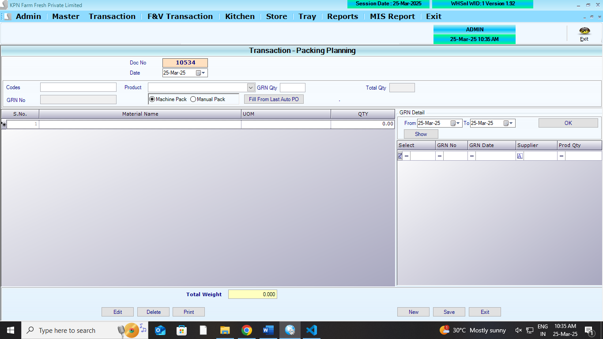
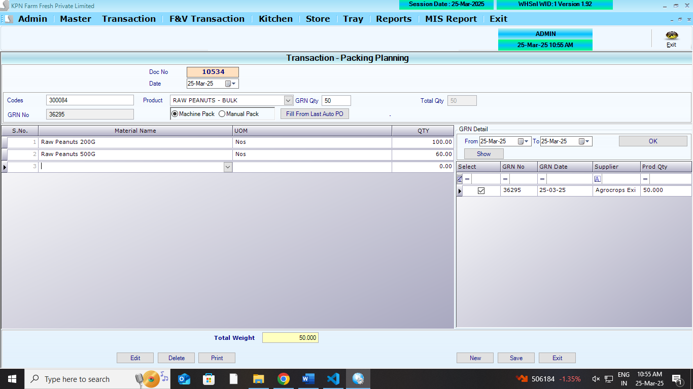
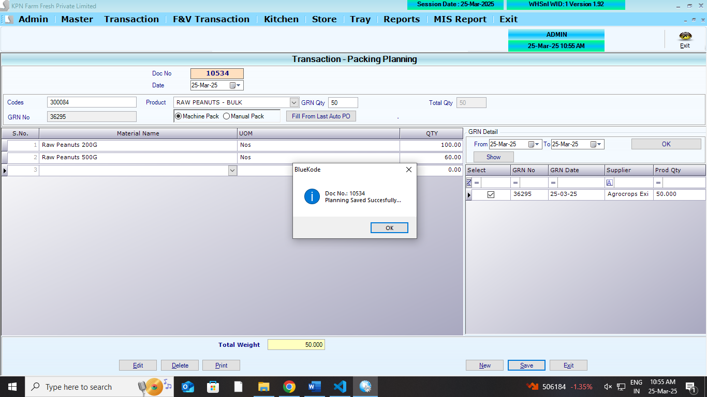

## Main Table

```
CREATE TABLE [dbo].[PlanningHdr](
[PL_id] [int] NOT NULL,
[PL_Year] [int] NULL,
[PL_ComId] [int] NULL,
[PL_date] [datetime] NULL,
[PL_UId] [int] NULL,
[PL_Batchno] [varchar](200) NULL,
[PL_Prodid] [int] NULL,
[PL_Qty] [numeric](9, 3) NULL,
[PL_GRNNo] [varchar](max) NULL,
[PL_Flag] [int] NULL,
[PL_GRNQty] [numeric](9, 3) NULL,
[PL_PreQty] [numeric](9, 3) NULL,
[PL_BalDtl] [varchar](100) NULL,
[PL_TotWeight] [numeric](18, 3) NULL,
[PL_PackType] [int] NULL,
[PL_PackedQty] [numeric](18, 3) NULL
) ON [PRIMARY] TEXTIMAGE_ON [PRIMARY]
GO
```

```
CREATE TABLE [dbo].[PlanningDtl](
	[PD_id] [int] NOT NULL,
	[PD_Year] [int] NOT NULL,
	[PD_ComId] [int] NOT NULL,
	[PD_Slno] [int] NULL,
	[PL_ProdId] [int] NULL,
	[PL_Qty] [numeric](18, 2) NULL,
	[PD_Weight] [numeric](18, 3) NULL
) ON [PRIMARY]
GO
```

## Affected Table

```
CREATE TABLE [dbo].[PurchaseDtl](
	[PD_ID] [int] NULL,
	[PD_Year] [int] NULL,
	[PD_Date] [datetime] NULL,
	[PD_Slno] [int] NULL,
	[PD_Prdid] [int] NULL,
	[PD_batchno] [nvarchar](20) NULL,
	[PD_expdate] [nvarchar](20) NULL,
	[PD_Qty] [decimal](18, 3) NULL,
	[PD_Free] [decimal](18, 3) NULL,
	[PD_Dis] [decimal](18, 2) NULL,
	[PD_DisAmt] [numeric](10, 3) NULL,
	[PD_Vat] [decimal](18, 2) NULL,
	[PD_VatAmt] [numeric](10, 3) NULL,
	[PD_Rate] [numeric](10, 3) NULL,
	[PD_Amt] [numeric](10, 3) NULL,
	[PD_ComId] [int] NULL,
	[PD_SuppID] [int] NULL,
	[PD_PONO] [int] NULL,
	[pd_AMargin] [numeric](10, 2) NULL,
	[PD_SalRate] [numeric](10, 2) NULL,
	[PD_MRP] [numeric](10, 2) NULL,
	[PD_CGST] [numeric](10, 2) NULL,
	[PD_SGST] [numeric](10, 2) NULL,
	[PD_CSS] [numeric](10, 2) NULL,
	[PD_CessAmt] [numeric](10, 2) NULL,
	[PD_POQty] [numeric](18, 3) NULL,
	[PD_Packflag] [int] NULL,
	[PD_Packqty] [numeric](9, 3) NULL,
	[PD_WHMargin] [numeric](18, 2) NULL,
	[PD_SalesMargin] [numeric](18, 2) NULL,
	[PD_ReasonDNAmt] [decimal](18, 2) NOT NULL,
	[PD_DNAmt] [decimal](18, 2) NOT NULL,
	[PD_RetQty] [numeric](18, 3) NULL
) ON [PRIMARY]
GO
```

```
CREATE TABLE [dbo].[AutoMbqPO](
	[AMP_ID] [int] NOT NULL,
	[AMP_Date] [datetime] NOT NULL,
	[AMP_Prdid] [int] NOT NULL,
	[AMP_Suppid] [int] NOT NULL,
	[AMP_Locid] [int] NOT NULL,
	[AMP_MBQDays] [int] NOT NULL,
	[AMP_SalesQty] [numeric](18, 3) NOT NULL,
	[AMP_MBQ] [numeric](18, 3) NOT NULL,
	[AMP_SOH] [numeric](18, 3) NOT NULL,
	[AMP_PO] [numeric](18, 3) NOT NULL,
	[AMP_POID] [int] NOT NULL,
	[AMP_UID] [int] NOT NULL,
	[WHStock] [numeric](18, 3) NULL,
	[POQty] [numeric](18, 3) NULL,
	[CaseQty] [numeric](18, 3) NULL,
	[WHDamage] [numeric](18, 3) NULL,
	[WHWaste] [numeric](18, 3) NULL,
	[WHSk] [numeric](18, 3) NULL,
	[AMP_Transit] [numeric](18, 3) NULL,
	[AMP_MDy] [int] NULL,
	[AMP_Max] [int] NULL,
	[AMP_Active] [varchar](10) NULL,
	[AMP_WHPO] [varchar](10) NULL,
	[AMP_Indent] [numeric](18, 3) NULL,
	[AMP_RQD] [numeric](18, 3) NULL,
	[AMP_AutoManualPO] [int] NOT NULL,
	[AMP_OutPONo] [int] NOT NULL,
	[AMP_MemoNo] [int] NOT NULL,
	[AMP_Approve] [int] NOT NULL,
	[AMP_ManulPONo] [int] NOT NULL,
	[AMP_Status] [int] NOT NULL,
	[AMP_AQty] [numeric](18, 2) NOT NULL,
	[AMP_PackQty] [numeric](18, 3) NOT NULL,
	[AMP_STDay] [int] NOT NULL
) ON [PRIMARY]
GO
```

## Referance screens

**Packing Planning opening screen**



**Packing Planning entry screen**




**Packing Planning save screen**




## Features

## Logics
1. List all bulk item in the product master table as drop down list . (parent product)
2. Load all child products in data grid.
3. then feed the Qty in the data grid table.
   **Logics** - List the all GRNS realted to that parent product (`PD_Qty` - `PD_Packqty` `> 0`)
   - by select the GRN in side screen, then load the Qty - to feed in grid
4. If the total weight of child product is matched with the total weight of parent product then the button will enable for saving
5. Direct posting to the table
6. In the GRN deatils (`PurchaseDtl`) `PD_Packqty` this to be updated
7. Also Fill from Last AUTO PO
