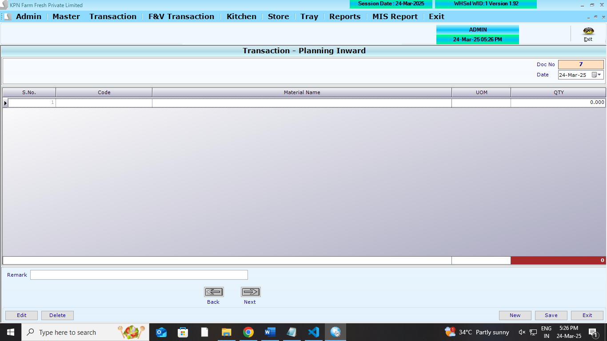
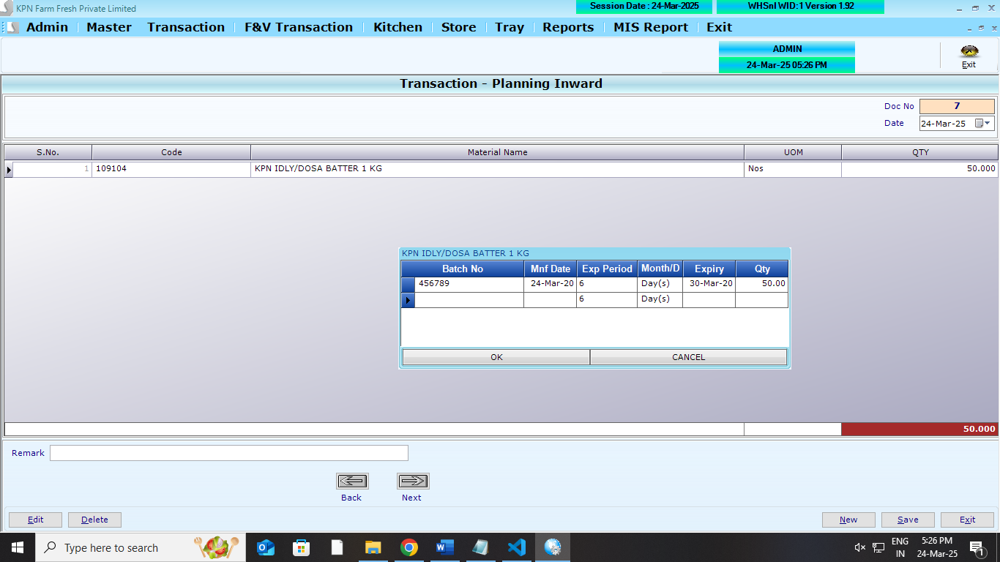
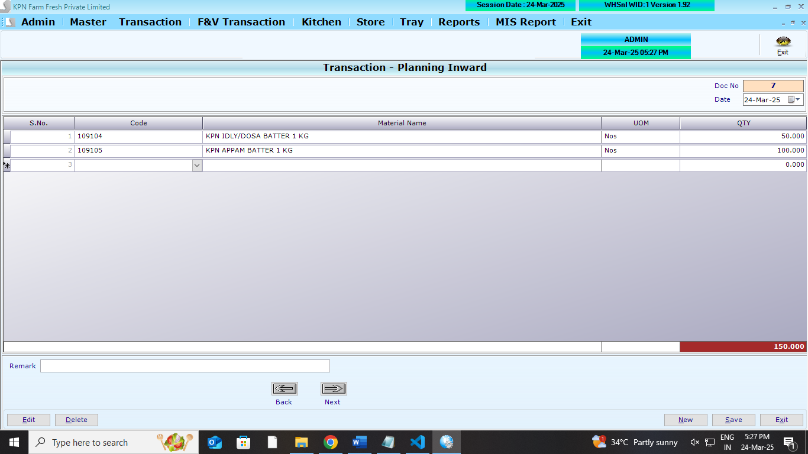
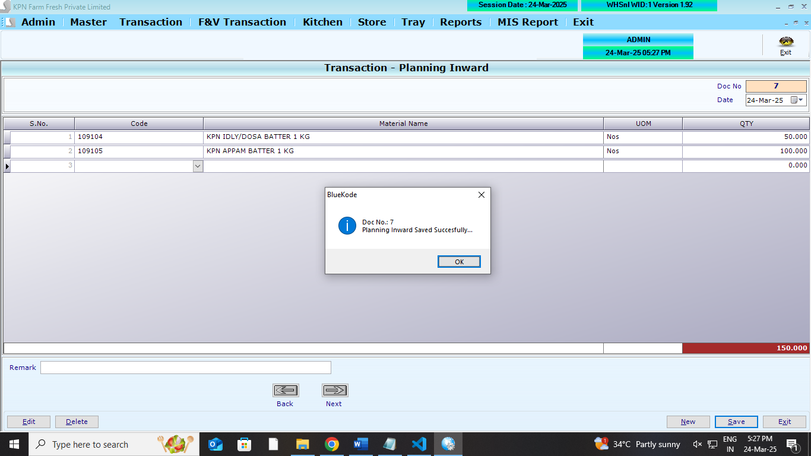

## Main Table

```
CREATE TABLE [dbo].[PLanInwardHdr](
	[P_ID] [int] NULL,
	[P_Year] [int] NULL,
	[P_Date] [datetime] NULL,
	[P_UID] [int] NULL,
	[P_MUID] [int] NULL,
	[P_ComId] [int] NULL,
	[P_Remark] [varchar](100) NULL
) ON [PRIMARY]
GO
```

```
CREATE TABLE [dbo].[PLanInwardDtl](
	[PD_ID] [int] NULL,
	[PD_Year] [int] NULL,
	[PD_Date] [datetime] NULL,
	[PD_Slno] [int] NULL,
	[PD_Prdid] [int] NULL,
	[PD_batchno] [nvarchar](20) NULL,
	[PD_expdate] [nvarchar](20) NULL,
	[PD_Qty] [decimal](18, 3) NULL,
	[PD_ComId] [int] NULL
) ON [PRIMARY]
GO

```

## Affected Table

```

CREATE TABLE [dbo].[StockLedger](
[SL_Date] [datetime] NULL,
[SL_items] [int] NULL,
[SL_batchno] [nvarchar](20) NULL,
[SL_expdate] [nvarchar](20) NULL,
[SL_PurQty] [decimal](18, 3) NULL,
[SL_SalQty] [decimal](18, 3) NULL,
[SL_WastQty] [decimal](18, 3) NULL,
[SL_SalRetQty] [decimal](18, 3) NULL,
[SL_PurRetQty] [decimal](18, 3) NULL,
[SL_UID] [int] NULL,
[SL_MUID] [int] NULL,
[SL_ComId] [int] NULL,
[SL_StkCorrQty] [numeric](10, 3) NULL,
[SL_StkcorrFlag] [int] NULL,
[SL_SCDate] [date] NULL,
[SL_SCUid] [int] NULL,
[SL_DCRetQty] [numeric](9, 3) NULL,
[SL_Closing] [numeric](18, 3) NULL,
[SL_MultiUnit] [int] NULL
) ON [PRIMARY]
GO

```

## REFERANCE SCREENS

**Planning inward opening screen**



**Planning inward entry screen**



**Planning inward entry screen**



**Planning inward save screen**




1.  All Screen logics are to done . refer screens


## Logics

- Crud Operations
- **StockLedger** - Logic to be done (`SL_PurQty`) `SL_PurQty`=`SL_PurQty` + `PD_Qty`
