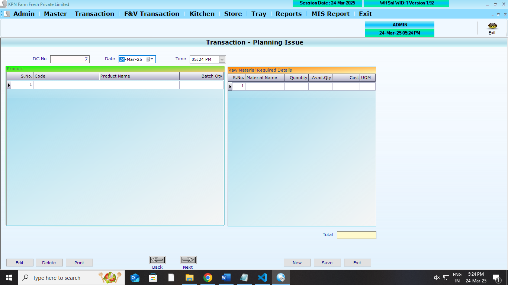
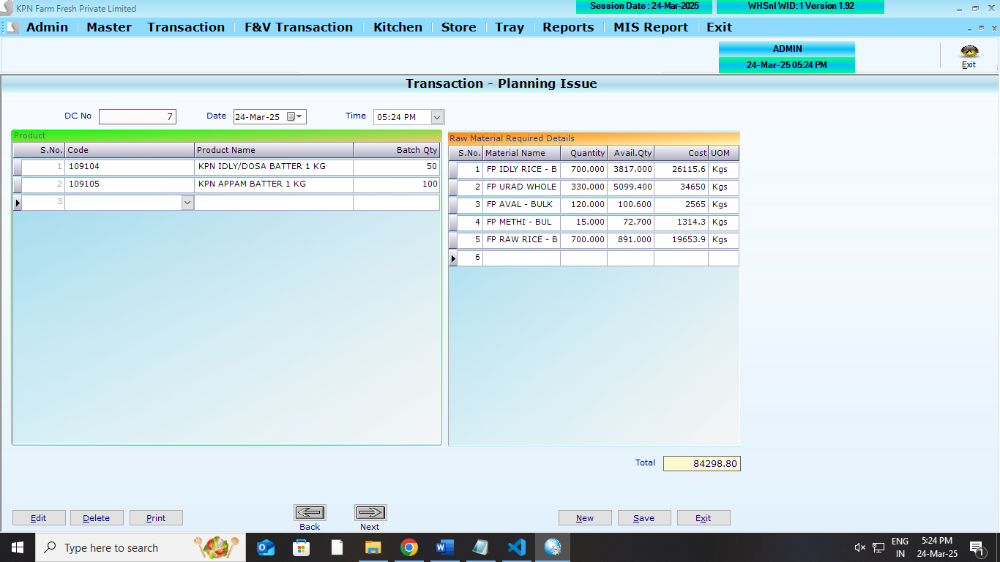
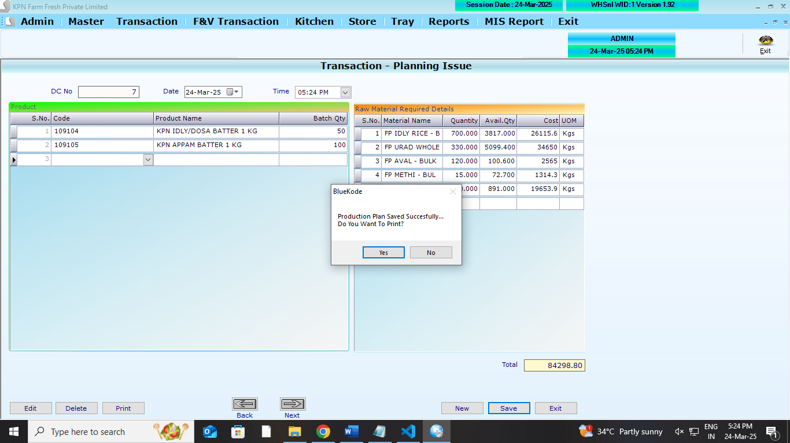

## Main Table

```
CREATE TABLE [dbo].[ProductPlanHdr](
	[PP_ID] [int] NOT NULL,
	[PP_date] [datetime] NULL,
	[PP_Time] [datetime] NULL,
	[PP_KitIssMst] [varchar](50) NULL,
	[PP_UID] [int] NOT NULL,
	[PP_CID] [int] NOT NULL,
	[PP_Year] [int] NOT NULL
) ON [PRIMARY]
GO
```

```
CREATE TABLE [dbo].[ProductPlanDtl](
	[PPD_ID] [int] NOT NULL,
	[PPD_SrlNo] [int] NULL,
	[PPD_MatId] [int] NULL,
	[PPD_Qty] [decimal](12, 3) NULL,
	[PPD_Tin] [decimal](12, 3) NULL,
	[PPD_CID] [int] NOT NULL,
	[PPD_Year] [int] NOT NULL
) ON [PRIMARY]
GO
```

```
CREATE TABLE [dbo].[ProductPlanReq](
	[PPR_ID] [int] NULL,
	[PPR_SrlNo] [int] NULL,
	[PPR_MatId] [int] NULL,
	[PPR_Qty] [decimal](12, 3) NULL,
	[PPR_AvailQty] [decimal](12, 3) NULL,
	[PPR_Cost] [decimal](12, 2) NULL,
	[PPR_CID] [int] NOT NULL,
	[PPR_Year] [int] NOT NULL
) ON [PRIMARY]
GO
```

## Affected Table

```
CREATE TABLE [dbo].[StockLedger](
	[SL_Date] [datetime] NULL,
	[SL_items] [int] NULL,
	[SL_batchno] [nvarchar](20) NULL,
	[SL_expdate] [nvarchar](20) NULL,
	[SL_PurQty] [decimal](18, 3) NULL,
	[SL_SalQty] [decimal](18, 3) NULL,
	[SL_WastQty] [decimal](18, 3) NULL,
	[SL_SalRetQty] [decimal](18, 3) NULL,
	[SL_PurRetQty] [decimal](18, 3) NULL,
	[SL_UID] [int] NULL,
	[SL_MUID] [int] NULL,
	[SL_ComId] [int] NULL,
	[SL_StkCorrQty] [numeric](10, 3) NULL,
	[SL_StkcorrFlag] [int] NULL,
	[SL_SCDate] [date] NULL,
	[SL_SCUid] [int] NULL,
	[SL_DCRetQty] [numeric](9, 3) NULL,
	[SL_Closing] [numeric](18, 3) NULL,
	[SL_MultiUnit] [int] NULL
) ON [PRIMARY]
GO
```
## REFERANCE SCREENS

**Planning issue opening screen**



**Planning issue entry screen**



**Planning issue save screen**



1.  All Screen logics are to done . refer screens

## Logics

1. List out the ProductPlanMst (Batch planning master)
2. with Batch qty Editable
3. based on Batch qty given. Raw material quantity to be calculated
4. **consider** - Batch planning master has per kg/qty
5. according to that raw material quantity to be calculated
6. **StockLedger** - Logic to be done (`SL_SalQty`) `SL_SalQty`=`SL_SalQty` + `PPR_Qty`
