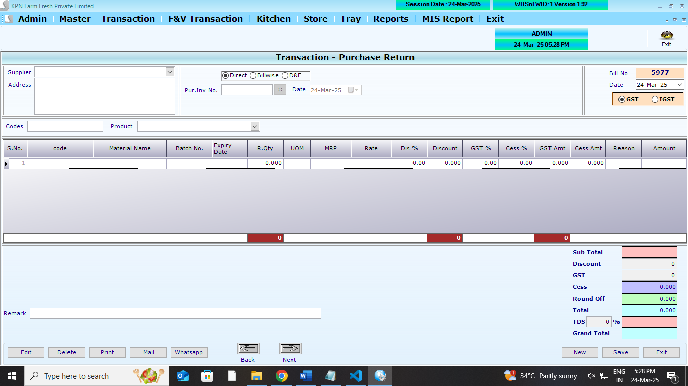
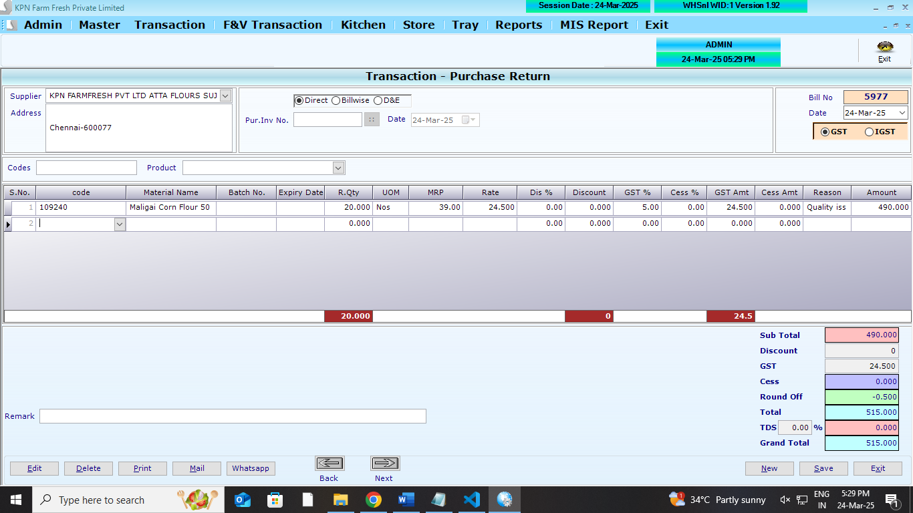
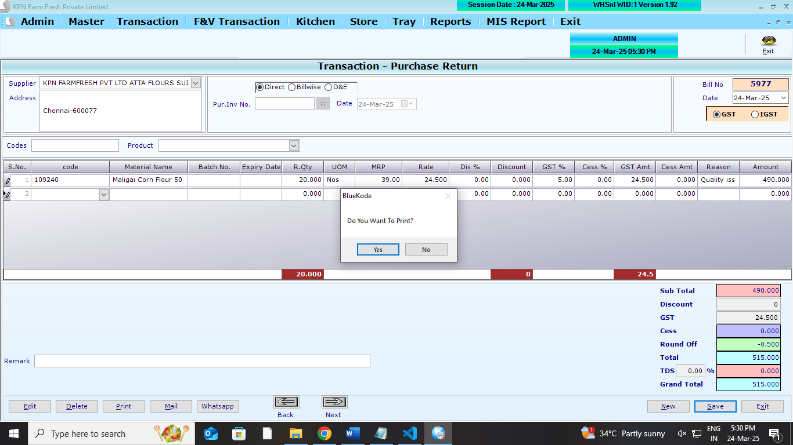

## Main Table

```
CREATE TABLE [dbo].[PurRetHdr](
	[PR_ID] [int] NULL,
	[PR_Year] [int] NULL,
	[PR_Date] [datetime] NULL,
	[PR_SuppId] [int] NULL,
	[PR_Tot] [numeric](10, 3) NULL,
	[PR_Discount] [numeric](10, 3) NULL,
	[PR_VatCstAmt] [numeric](10, 3) NULL,
	[PR_GTot] [numeric](10, 3) NULL,
	[PR_PurDoc] [int] NULL,
	[PR_PurInvNo] [nvarchar](30) NULL,
	[PR_UID] [int] NULL,
	[PR_MUID] [int] NULL,
	[PR_RoundOff] [numeric](10, 3) NULL,
	[PR_ComId] [int] NULL,
	[PR_PurInvDt] [datetime] NULL,
	[PR_Type] [int] NULL,
	[PR_Cess] [numeric](10, 3) NULL,
	[PR_GSTorIGST] [int] NULL,
	[PR_Remark] [varchar](100) NULL,
	[PR_TDSPer] [numeric](18, 2) NOT NULL,
	[PR_TDSAmt] [numeric](18, 2) NOT NULL,
	[eway] [int] NULL,
	[Ewayno] [varchar](100) NULL,
	[Ewaydate] [datetime] NULL,
	[EwayValidDate] [datetime] NULL,
	[EWayPath] [varchar](500) NULL,
	[Einvoice] [int] NULL,
	[Ackno] [varchar](200) NULL,
	[Ackdate] [datetime] NULL,
	[irnno] [varchar](500) NULL,
	[PR_EffectDate] [datetime] NOT NULL
) ON [PRIMARY]
GO
```

```
CREATE TABLE [dbo].[PurRetDtl](
	[PRD_ID] [int] NULL,
	[PRD_Year] [int] NULL,
	[PRD_Date] [datetime] NULL,
	[PRD_Slno] [int] NULL,
	[PRD_Prdid] [int] NULL,
	[PRD_batchno] [nvarchar](20) NULL,
	[PRD_expdate] [nvarchar](20) NULL,
	[PRD_Qty] [decimal](18, 3) NULL,
	[PRD_QtyAct] [decimal](18, 3) NULL,
	[PRD_Free] [decimal](18, 3) NULL,
	[PRD_FreeAct] [decimal](18, 3) NULL,
	[PRD_Dis] [decimal](18, 2) NULL,
	[PRD_DisAmt] [numeric](10, 3) NULL,
	[PRD_Vat] [decimal](18, 2) NULL,
	[PRD_VatAmt] [numeric](10, 3) NULL,
	[PRD_Rate] [numeric](10, 3) NULL,
	[PRD_Amt] [numeric](10, 3) NULL,
	[PRD_ComId] [int] NULL,
	[PRD_SuppID] [int] NULL,
	[PRD_CGST] [numeric](10, 2) NULL,
	[PRD_SGST] [numeric](10, 2) NULL,
	[PRD_Cess] [numeric](10, 2) NULL,
	[PRD_CessAmt] [numeric](10, 2) NULL,
	[PRD_Reason] [int] NULL,
	[PRD_Mrp] [numeric](18, 2) NULL,
	[PRD_MobRetId] [int] NOT NULL,
	[PRD_MemoRetQty] [numeric](18, 3) NOT NULL
) ON [PRIMARY]
GO
```

## Affected Table

```
CREATE TABLE [dbo].[StockLedger](
	[SL_Date] [datetime] NULL,
	[SL_items] [int] NULL,
	[SL_batchno] [nvarchar](20) NULL,
	[SL_expdate] [nvarchar](20) NULL,
	[SL_PurQty] [decimal](18, 3) NULL,
	[SL_SalQty] [decimal](18, 3) NULL,
	[SL_WastQty] [decimal](18, 3) NULL,
	[SL_SalRetQty] [decimal](18, 3) NULL,
	[SL_PurRetQty] [decimal](18, 3) NULL,
	[SL_UID] [int] NULL,
	[SL_MUID] [int] NULL,
	[SL_ComId] [int] NULL,
	[SL_StkCorrQty] [numeric](10, 3) NULL,
	[SL_StkcorrFlag] [int] NULL,
	[SL_SCDate] [date] NULL,
	[SL_SCUid] [int] NULL,
	[SL_DCRetQty] [numeric](9, 3) NULL,
	[SL_Closing] [numeric](18, 3) NULL,
	[SL_MultiUnit] [int] NULL
) ON [PRIMARY]
GO
```

```
CREATE TABLE [dbo].[DnEStockLedger](
	[DL_Date] [datetime] NULL,
	[DL_items] [int] NULL,
	[DL_Inward] [decimal](18, 3) NULL,
	[DL_Outward] [decimal](18, 3) NULL,
	[DL_UID] [int] NULL,
	[DL_MUID] [int] NULL,
	[DL_ComId] [int] NULL,
	[DL_StkCorrQty] [numeric](18, 3) NULL,
	[DL_StkcorrFlag] [int] NULL,
	[DL_SCDate] [date] NULL,
	[DL_SCUid] [int] NULL
) ON [PRIMARY]
GO
```

```
CREATE TABLE [dbo].[Partyledger](
	[PL_id] [int] NULL,
	[PL_Did] [int] NULL,
	[PL_Date] [datetime] NULL,
	[PL_Type] [nvarchar](2) NULL,
	[PL_No] [int] NULL,
	[PL_Mode] [int] NULL,
	[PL_Chequeno] [nvarchar](15) NULL,
	[PL_Cdate] [datetime] NULL,
	[PL_Credit] [decimal](18, 2) NULL,
	[PL_Debit] [decimal](18, 2) NULL,
	[PL_Remarks] [nvarchar](max) NULL,
	[PL_PtTyp] [nvarchar](5) NULL,
	[PL_ComId] [int] NULL
) ON [PRIMARY] TEXTIMAGE_ON [PRIMARY]
GO
```

## REFERANCE SCREENS

**Purchase return opening screen**



**Purchase return entry screen**



**Purchase return save screen**


**Purchase return save screen**


**Purchase return save screen**


**Purchase return save screen**




1.  All Screen logics are to done . refer screens

## LOGICs

1. Direct return
2. Bill wise/GRN wise return
3. D&E (Damage and Expired)
4. When Bill wise/GRN wise return, need to check in PurchaseMemoDtl - `PD_RetQty`
5. if `PD_RetQty` is there, no need to update Stock Ledger `SL_PurRetQty`
6. if we choose D&E (Damage and Expired)

   - item can import items from mobile app
   - item can import items from retun verification
   - Rule: per day against one product row should be there in DnEStockLedger
   - DL_Outward `if no record, insert  against date. if there is record update the DL_Outward against date`

7. Partyledger

- ** Rule 1**: If any item is not present in the partyledger, then it will be added
- if PL_Credit exsists , then it will be added to PL_Credit .
  - `PL_Credit`
  - `PL_Type` to be `PR` for purchase
  - `PL_No` - this Doc number (`PR_ID`)
  - `PL_Mode` - `0` to be posted
  - `PL_Chequeno` - `empty` to be posted
  - `PL_Cdate` - `doc date` to be posted
  - `PL_Credit` - `0` to be posted
  - `PL_Remarks` - `Purchase return (PR_ID)` to be posted
  - `PL_PtTyp` - `S` to be posted
  - `PL_ComId` - `company_id` to be posted
