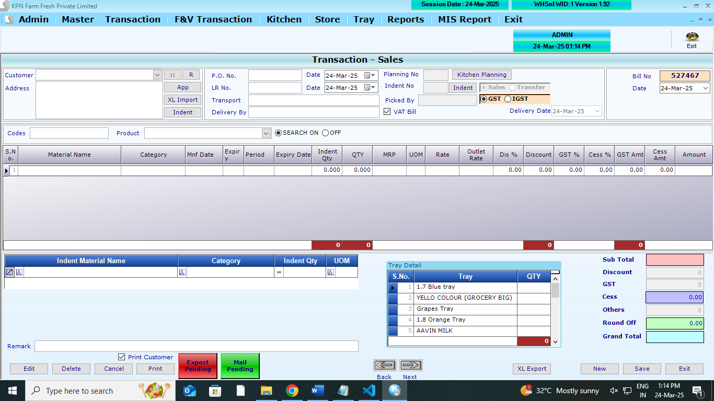
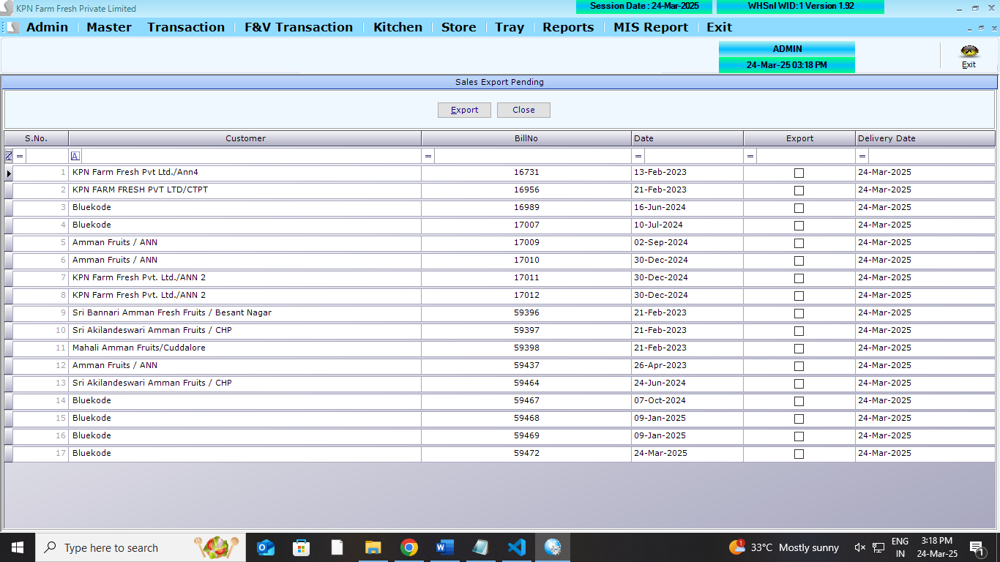
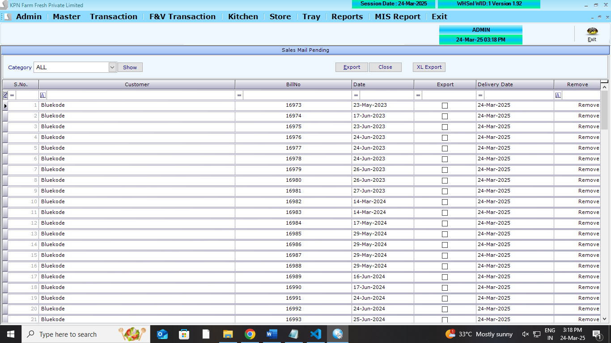
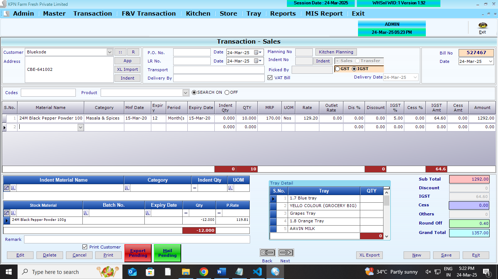
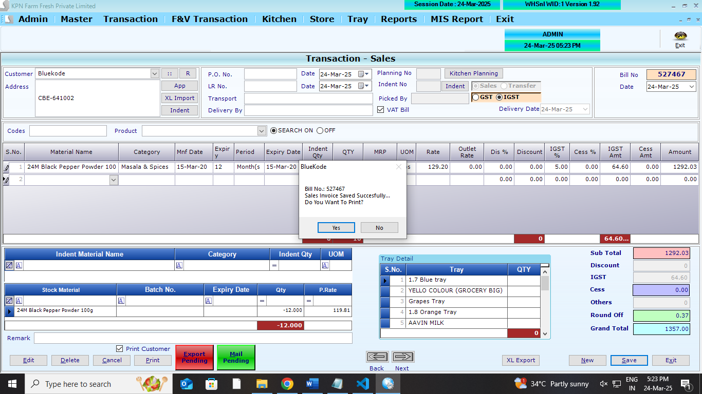

## Main Table

```
CREATE TABLE [dbo].[SalesHdr](
	[S_ID] [int] NOT NULL,
	[S_Year] [int] NOT NULL,
	[S_Date] [datetime] NULL,
	[S_CustId] [int] NULL,
	[S_Tot] [decimal](18, 2) NULL,
	[S_Discount] [decimal](18, 2) NULL,
	[S_VatCstAmt] [decimal](18, 2) NULL,
	[S_GTot] [decimal](18, 2) NULL,
	[S_UID] [int] NULL,
	[S_MUID] [int] NULL,
	[S_RoundOff] [decimal](18, 2) NULL,
	[S_Paid] [decimal](18, 2) NULL,
	[S_PayStat] [int] NULL,
	[S_RetAmt] [decimal](18, 2) NULL,
	[S_ComId] [int] NOT NULL,
	[S_PONO] [nvarchar](50) NULL,
	[S_PODate] [datetime] NULL,
	[S_LRNO] [nvarchar](50) NULL,
	[S_LRDate] [datetime] NULL,
	[S_Trans] [nvarchar](50) NULL,
	[S_DelBy] [nvarchar](50) NULL,
	[S_PGTot] [float] NULL,
	[S_Others] [float] NULL,
	[S_VatBill] [int] NULL,
	[S_GSTorIGST] [int] NULL,
	[S_Advance] [float] NULL,
	[S_DelStat] [int] NULL,
	[S_Type] [int] NOT NULL,
	[S_CessAmt] [numeric](10, 2) NULL,
	[S_Remark] [varchar](100) NULL,
	[S_ExportPend] [int] NULL,
	[S_DlvyDt] [datetime] NULL,
	[S_Prefix] [varchar](20) NULL,
	[S_DCNO] [int] NULL,
	[S_AutoGenID] [int] NULL,
	[S_Mail] [int] NULL,
	[S_Planid] [int] NULL,
	[S_IndentId] [int] NULL,
	[S_ExpUID] [int] NULL,
	[S_ExpDt] [datetime] NULL,
	[S_MSUid] [int] NULL,
	[S_MSDocID] [int] NULL,
	[S_MSDate] [datetime] NULL,
	[S_MblExp] [int] NULL,
	[S_VehNo] [varchar](50) NULL,
	[einvoice] [int] NULL,
	[Ackno] [varchar](500) NULL,
	[Ackdate] [datetime] NULL,
	[Irnno] [varchar](500) NULL,
	[S_DCFinYr] [int] NULL,
	[S_Verify] [int] NOT NULL,
	[S_VerfyUID] [int] NOT NULL,
	[EWay] [int] NULL,
	[Ewayno] [varchar](100) NULL,
	[Ewaydate] [datetime] NULL,
	[EwayValidDate] [datetime] NULL,
	[EInvoicePath] [varchar](500) NULL,
	[EWayPath] [varchar](500) NULL,
	[S_ExpSchedule] [datetime] NOT NULL,
	[S_WPid] [varchar](100) NOT NULL,
	[S_WPDate] [datetime] NOT NULL,
	[S_VehNoID] [int] NOT NULL,
	[S_SealNo] [varchar](50) NOT NULL,
	[S_Driver] [varchar](50) NOT NULL,
	[S_TRipNo] [int] NOT NULL,
	[S_CreateDt] [datetime] NOT NULL,
	[Reference] [varchar](100) NULL,
PRIMARY KEY NONCLUSTERED
(
	[S_ID] ASC,
	[S_Year] ASC,
	[S_ComId] ASC,
	[S_Type] ASC
)WITH (PAD_INDEX = OFF, STATISTICS_NORECOMPUTE = OFF, IGNORE_DUP_KEY = OFF, ALLOW_ROW_LOCKS = ON, ALLOW_PAGE_LOCKS = ON, FILLFACTOR = 80, OPTIMIZE_FOR_SEQUENTIAL_KEY = OFF) ON [PRIMARY]
) ON [PRIMARY]
GO
```

```
CREATE TABLE [dbo].[SalesDtl](
	[SD_ID] [int] NULL,
	[SD_Year] [int] NULL,
	[SD_Date] [datetime] NULL,
	[SD_Slno] [int] NULL,
	[SD_Prdid] [int] NULL,
	[SD_batchno] [nvarchar](100) NULL,
	[SD_expdate] [nvarchar](100) NULL,
	[SD_Qty] [decimal](18, 3) NULL,
	[SD_Free] [decimal](18, 3) NULL,
	[SD_Dis] [decimal](18, 2) NULL,
	[SD_DisAmt] [decimal](18, 2) NULL,
	[SD_Vat] [decimal](18, 2) NULL,
	[SD_VatAmt] [decimal](18, 2) NULL,
	[SD_Rate] [decimal](18, 2) NULL,
	[SD_Amt] [decimal](18, 2) NULL,
	[SD_ComId] [int] NULL,
	[SD_PRate] [float] NULL,
	[SD_PAmt] [float] NULL,
	[SD_SuppID] [int] NULL,
	[SD_Type] [int] NULL,
	[SD_CGST] [numeric](10, 2) NULL,
	[SD_SGST] [numeric](10, 2) NULL,
	[SD_Cess] [numeric](10, 2) NULL,
	[SD_CessAmt] [numeric](10, 2) NULL,
	[SD_TrayId] [int] NULL,
	[SD_TrayQty] [int] NULL,
	[SD_GrossQty] [numeric](10, 2) NULL,
	[SD_PackId] [int] NULL,
	[SD_expdate1] [datetime] NULL,
	[SD_Mnfdate] [datetime] NULL,
	[SD_ExpMonth] [int] NULL,
	[SD_Mrp] [numeric](18, 2) NULL,
	[SD_MnthDay] [int] NULL,
	[SD_AutoBatch] [int] NULL,
	[SD_OutRate] [int] NULL,
	[SD_Indent] [int] NULL,
	[SD_IndentDt] [datetime] NULL,
	[SD_IndentQty] [numeric](18, 3) NULL,
	[SD_AlterUOMId] [int] NULL,
	[SD_AlterQty] [numeric](18, 3) NULL,
	[SD_AlterContain] [numeric](18, 3) NULL,
	[SD_UomEdit] [int] NULL,
	[SD_AlterRate] [numeric](18, 2) NULL,
	[SD_Barcode] [varchar](50) NULL,
	[SD_PickerID] [int] NOT NULL,
	[SD_GroAlltID] [int] NOT NULL
) ON [PRIMARY]
GO
```

```
CREATE TABLE [dbo].[SalesTrayDtl](
	[ST_ID] [int] NULL,
	[ST_Date] [datetime] NULL,
	[ST_Year] [int] NULL,
	[ST_Slno] [int] NULL,
	[ST_Trayid] [int] NULL,
	[ST_Qty] [int] NULL,
	[ST_ComId] [int] NULL,
	[ST_Custid] [int] NULL,
	[ST_Type] [int] NULL
) ON [PRIMARY]
GO
```

## Affected Table

```
CREATE TABLE [dbo].[Trayledger](
	[Tl_Date] [datetime] NULL,
	[TL_CustId] [int] NULL,
	[TL_RecQty] [int] NULL,
	[TL_IssQty] [int] NULL,
	[TL_TrayID] [int] NULL,
	[TL_WasteQty] [int] NULL,
	[TL_Opening] [int] NULL,
	[TL_Balance] [int] NULL,
	[TL_ComId] [int] NULL,
	[TL_Year] [int] NULL,
	[TL_Type] [int] NULL
) ON [PRIMARY]
GO
```

```
CREATE TABLE [dbo].[StockLedger](
	[SL_Date] [datetime] NULL,
	[SL_items] [int] NULL,
	[SL_batchno] [nvarchar](20) NULL,
	[SL_expdate] [nvarchar](20) NULL,
	[SL_PurQty] [decimal](18, 3) NULL,
	[SL_SalQty] [decimal](18, 3) NULL,
	[SL_WastQty] [decimal](18, 3) NULL,
	[SL_SalRetQty] [decimal](18, 3) NULL,
	[SL_PurRetQty] [decimal](18, 3) NULL,
	[SL_UID] [int] NULL,
	[SL_MUID] [int] NULL,
	[SL_ComId] [int] NULL,
	[SL_StkCorrQty] [numeric](10, 3) NULL,
	[SL_StkcorrFlag] [int] NULL,
	[SL_SCDate] [date] NULL,
	[SL_SCUid] [int] NULL,
	[SL_DCRetQty] [numeric](9, 3) NULL,
	[SL_Closing] [numeric](18, 3) NULL,
	[SL_MultiUnit] [int] NULL
) ON [PRIMARY]
GO
```

```
CREATE TABLE [dbo].[Partyledger](
	[PL_id] [int] NULL,
	[PL_Did] [int] NULL,
	[PL_Date] [datetime] NULL,
	[PL_Type] [nvarchar](2) NULL,
	[PL_No] [int] NULL,
	[PL_Mode] [int] NULL,
	[PL_Chequeno] [nvarchar](15) NULL,
	[PL_Cdate] [datetime] NULL,
	[PL_Credit] [decimal](18, 2) NULL,
	[PL_Debit] [decimal](18, 2) NULL,
	[PL_Remarks] [nvarchar](max) NULL,
	[PL_PtTyp] [nvarchar](5) NULL,
	[PL_ComId] [int] NULL
) ON [PRIMARY] TEXTIMAGE_ON [PRIMARY]
GO
```

## REFERANCE SCREENS

**Sales opening screen**



**Sales export pending screen**



**Sales mail pending screen**



**Sales entry screen**



**Sales save screen**




1.  All Screen logics are to done . refer screens

## FEATURES REQUIRED

1. Excel Import options - (product_code,qty) . remaining fields will be auto populated from the database.
2. App import option

## LOGICs

1.  Select customer/outlet, Po no, po date,LR no, Lr date, Transporter, Delivery By these to be filled on screen.
2.  Picked by default `0`
3.  `S_MSUid` - `0`
4.  Item wise - `Expiry date to be calculated based on manufacture date and Expiry Period`
5.  MRP Logic
    - if multiple MRP available for an items,
      1. check customer sales margin available or not , if need sales_margin,
      2. Based on MRP, need to fetch latest Purchase rate in purchase deatils (if mrp availabe , need where condition on MRP) - this name it as CP(cost price)
      3. if customer type = `Own`
         CP= last_purchase
         sale_rate= CP+CP\*sales_margin/100
      4. if customer type = `PartnerShip`
         CP= last_purchase
         sale_rate= CP+CP\*sales_margin/100
      5. if customer type = `Franchise`
         - **Rule** product master must have sales_margin .ie greater than Zero
         - if less than Zero , sals_rate = 0
           CP_GST = MRP -MRP \*(sales_margin) /100
           Tax_Value = CP_GST \*(gst_per) /100
           Cess_Value = CP_GST \*(cess_per) /100
           sals_rate = CP_GST - (Tax_Value + Cess_Value)
      6. if customer type = `Exception`
         CP = last_purchase - (discount percentage in product master)
         sale_rate= CP+CP\*sales_margin/100
6.  Tray Entry to be there
7.  Tray ledger logic to be done
8.  Stock Ledger logic to be done
9.  `StockLedger` table below should affect

    - Note: if row does not exsists against `date and prodid` insert new row
    - For a date and prodid only one row should be there.
    - if row exsists update exsisting `SL_SalQty` with `qty` from the sales details contracts row against `date and prodid`

    - if mode is `Transfer`

      - no need to gst calculation . need to update `SL_SalQty `
      - Note: if row does not exsists against `date and prodid` insert new row
      - For a date and prodid only one row should be there.

10. Partyledger

- ** Rule 1**: If any item is not present in the partyledger, then it will be added
- if PL_Debit exsists , then it will be added to PL_Debit .
  - `PL_Debit`
  - `PL_Type` to be `S` for Sales (`T` for transfer)
  - `PL_No` - this Doc number (`S_ID`)
  - `PL_Mode` - `0` to be posted
  - `PL_Chequeno` - `empty` to be posted
  - `PL_Cdate` - `doc date` to be posted
  - `PL_Credit` - `0` to be posted
  - `PL_Remarks` - `Sales Inv no (S_ID)` to be posted
  - `PL_PtTyp` - `C` to be posted
  - `PL_ComId` - `company_id` to be posted
