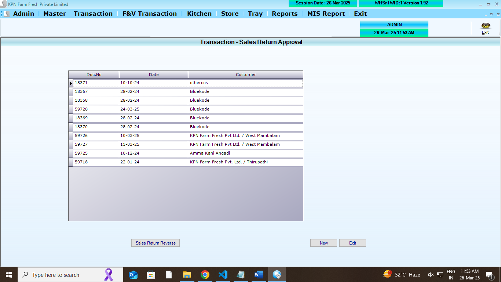
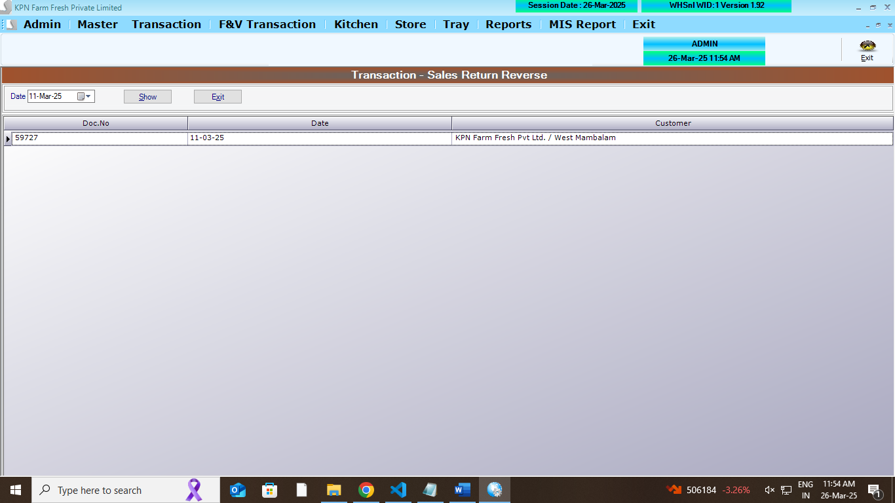
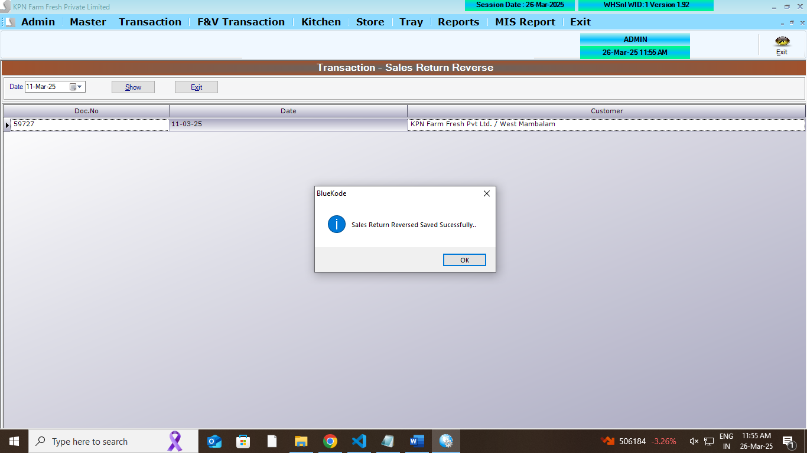
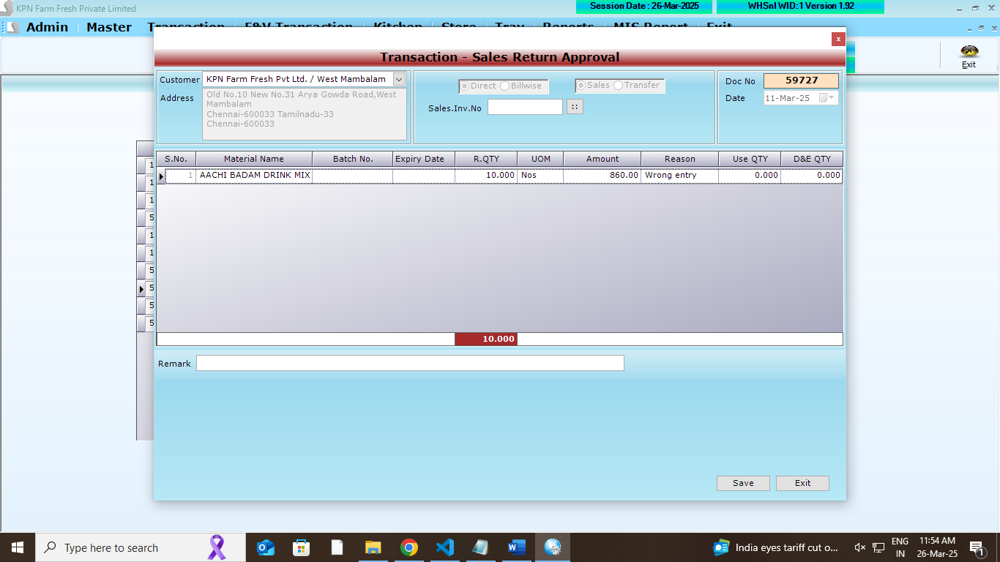
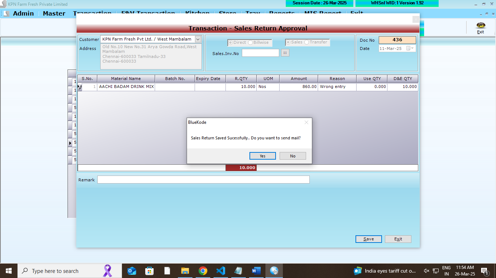

## Main Tables

```
CREATE TABLE [dbo].[SalRetHdr](
	[SR_ID] [int] NULL,
	[SR_Year] [int] NULL,
	[SR_Date] [datetime] NULL,
	[SR_CustId] [int] NULL,
	[SR_Tot] [decimal](18, 2) NULL,
	[SR_Discount] [decimal](18, 2) NULL,
	[SR_VatCstAmt] [decimal](18, 2) NULL,
	[SR_GTot] [decimal](18, 2) NULL,
	[SR_InvNo] [nvarchar](20) NULL,
	[SR_SalesDocId] [int] NULL,
	[SR_UID] [int] NULL,
	[SR_MUID] [int] NULL,
	[SR_RoundOff] [decimal](18, 2) NULL,
	[SR_ComId] [int] NULL,
	[SR_Type] [int] NULL,
	[SR_AppFlag] [int] NULL,
	[SR_CessAmt] [numeric](10, 2) NULL,
	[SR_SalType] [int] NULL,
	[SR_GSTorIGST] [int] NULL,
	[SR_Remark] [varchar](100) NULL,
	[SR_Verifyid] [int] NULL,
	[Einvoice] [int] NULL,
	[Ackno] [varchar](200) NULL,
	[Ackdate] [datetime] NULL,
	[Irnno] [varchar](500) NULL
) ON [PRIMARY]
GO
```

```
CREATE TABLE [dbo].[SalRetDtl](
	[SRD_ID] [int] NULL,
	[SRD_Year] [int] NULL,
	[SRD_Date] [datetime] NULL,
	[SRD_Slno] [int] NULL,
	[SRD_Prdid] [int] NULL,
	[SRD_batchno] [nvarchar](20) NULL,
	[SRD_expdate] [nvarchar](20) NULL,
	[SRD_ActQty] [decimal](18, 3) NULL,
	[SRD_Qty] [decimal](18, 3) NULL,
	[SRD_ActFree] [decimal](18, 3) NULL,
	[SRD_Free] [decimal](18, 3) NULL,
	[SRD_Dis] [decimal](18, 2) NULL,
	[SRD_DisAmt] [decimal](18, 2) NULL,
	[SRD_Vat] [decimal](18, 2) NULL,
	[SRD_VatAmt] [decimal](18, 2) NULL,
	[SRD_Rate] [decimal](18, 2) NULL,
	[SRD_Amt] [decimal](18, 2) NULL,
	[SRD_ComId] [int] NULL,
	[SRD_SuppID] [int] NULL,
	[SRD_Reason] [int] NULL,
	[SRD_CGST] [numeric](10, 2) NULL,
	[SRD_SGST] [numeric](10, 2) NULL,
	[SRD_Cess] [numeric](10, 2) NULL,
	[SRD_CessAmt] [numeric](10, 2) NULL,
	[SRD_SalType] [int] NULL,
	[SRD_MRP] [numeric](18, 2) NULL,
	[SRD_WHStock] [numeric](12, 3) NULL,
	[SRD_DnE] [numeric](12, 3) NULL
) ON [PRIMARY]
GO
```

## Affected Table

```
CREATE TABLE [dbo].[Partyledger](
	[PL_id] [int] NULL,
	[PL_Did] [int] NULL,
	[PL_Date] [datetime] NULL,
	[PL_Type] [nvarchar](2) NULL,
	[PL_No] [int] NULL,
	[PL_Mode] [int] NULL,
	[PL_Chequeno] [nvarchar](15) NULL,
	[PL_Cdate] [datetime] NULL,
	[PL_Credit] [decimal](18, 2) NULL,
	[PL_Debit] [decimal](18, 2) NULL,
	[PL_Remarks] [nvarchar](max) NULL,
	[PL_PtTyp] [nvarchar](5) NULL,
	[PL_ComId] [int] NULL
) ON [PRIMARY] TEXTIMAGE_ON [PRIMARY]
GO
```

```
CREATE TABLE [dbo].[store_return](
	[outletId] [int] NULL,
	[docid] [int] NULL,
	[docdate] [datetime] NULL,
	[billtype] [int] NULL,
	[billno] [varchar](100) NULL,
	[billdate] [varchar](12) NULL,
	[srid] [int] NULL,
	[prod_code] [varchar](20) NULL,
	[send_qty] [numeric](12, 3) NULL,
	[recd_qty] [numeric](12, 3) NULL,
	[reason] [varchar](200) NULL,
	[reason1] [varchar](200) NULL,
	[flag] [int] NULL,
	[status] [int] NULL,
	[WHStock] [numeric](12, 3) NULL,
	[DnE] [numeric](12, 3) NULL,
	[verifydate] [datetime] NULL,
	[verifyUser] [int] NULL,
	[RejectQty] [numeric](12, 3) NULL,
	[Rjt_Reason] [varchar](100) NULL,
	[batchno] [nvarchar](40) NOT NULL,
	[expdate] [nvarchar](40) NOT NULL,
	[Wid] [int] NULL
) ON [PRIMARY]
GO
```

## REFERANCE SCREENS

**Sales return Approval opening screen**



**Sales return Approval entry screen**



**Sales return Approval save screen**


**Sales return Approval save screen**



**Sales return Approval entry screen**



**Sales return Approval save screen**




1.  All Screen logics are to done . refer screens

## FEATURES REQUIRED

## LOGICS

- LIst the return docno
- load the docno items in grid
- approval flag to be changed in master table
- StockLedger Logic `SL_SalRetQty`
- Sales return approval reverse option to be done.
  - this should work before clsing the stock
  - recalulate stock to previoues stage (i.e before approval)
