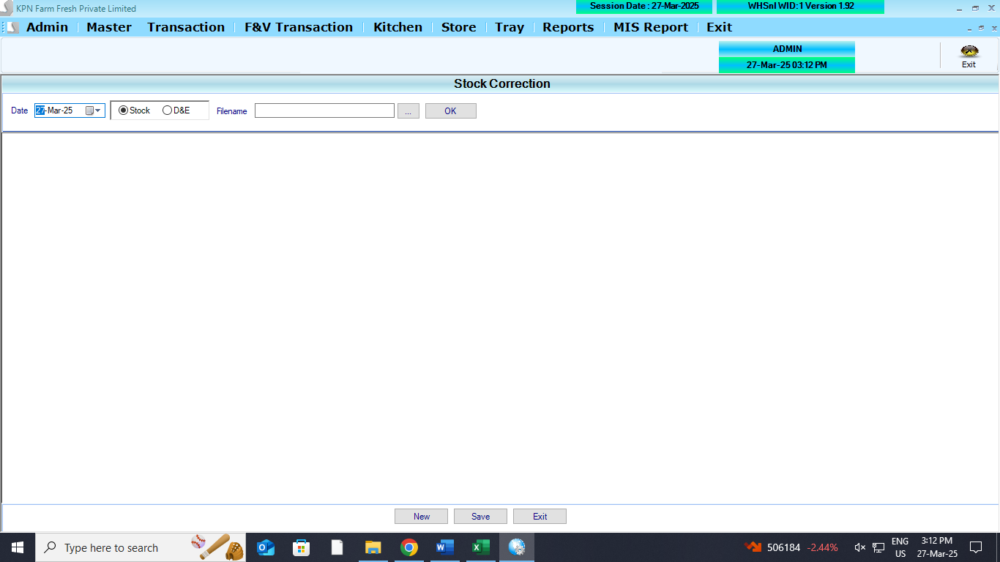

# Closing Stock Module Logics

## Screen

| Date | ... |

| Sno | Code | Item | Qty |
| --- | ---- | ---- | --- |
| 1   | xxx  |      |     |
| 2   |      |      |     |
| ... | ...  | ...  | ... |
|     |      |      |     |

## Tables

    1. closing_stock
        - id
        - docdate
        - prodid
        - physical_qty
        - computer_qty
        - purchase_rate
        - sales_rate
        - mrp
        - company_id
        - created_by
        - updated_by
        - created_at
        - updated_at

## Affeccted table

```

CREATE TABLE [dbo].[StockLedger](
[SL_Date] [datetime] NULL,
[SL_items] [int] NULL,
[SL_batchno] [nvarchar](20) NULL,
[SL_expdate] [nvarchar](20) NULL,
[SL_PurQty] [decimal](18, 3) NULL,
[SL_SalQty] [decimal](18, 3) NULL,
[SL_WastQty] [decimal](18, 3) NULL,
[SL_SalRetQty] [decimal](18, 3) NULL,
[SL_PurRetQty] [decimal](18, 3) NULL,
[SL_UID] [int] NULL,
[SL_MUID] [int] NULL,
[SL_ComId] [int] NULL,
[SL_StkCorrQty] [numeric](10, 3) NULL,
[SL_StkcorrFlag] [int] NULL,
[SL_SCDate] [date] NULL,
[SL_SCUid] [int] NULL,
[SL_DCRetQty] [numeric](9, 3) NULL,
[SL_Closing] [numeric](18, 3) NULL,
[SL_MultiUnit] [int] NULL
) ON [PRIMARY]
GO
```

```
CREATE TABLE [dbo].[DnEStockLedger](
	[DL_Date] [datetime] NULL,
	[DL_items] [int] NULL,
	[DL_Inward] [decimal](18, 3) NULL,
	[DL_Outward] [decimal](18, 3) NULL,
	[DL_UID] [int] NULL,
	[DL_MUID] [int] NULL,
	[DL_ComId] [int] NULL,
	[DL_StkCorrQty] [numeric](18, 3) NULL,
	[DL_StkcorrFlag] [int] NULL,
	[DL_SCDate] [date] NULL,
	[DL_SCUid] [int] NULL
) ON [PRIMARY]
GO

```

## API Contracts

### -id ,-created_by, - update_by, - created_at, - update_at. this to be maintained from backend apis

```json
[
  {
    "docdate": "string", // date-time
    "prodid": "integer",
    "physical_qty": "number",
    "computer_qty": "number",
    "purchase_rate": "number",
    "sales_rate": "number",
    "mrp": "number",
    "company_id": "integer"
  },
  {
    "docdate": "string", // date-time
    "prodid": "integer",
    "physical_qty": "number",
    "computer_qty": "number",
    "purchase_rate": "number",
    "sales_rate": "number",
    "mrp": "number",
    "company_id": "integer"
  }
]
```

## Refernce Screen


**Stock Correction entry screen**




## LOGICs

1. when inserting per date per prodid only one should be there
2. check given date exisits in table or not
3. if given date exsists in table , dont need to insert. need throw custom error.
4. if given date does not exsists, then need to check whether given date should be greater than exsisting table date.
5. if given date less than table date ,need throw custom error.
6. otherwise need insert.
7. **StockLedger** - Logic to be done (`SL_StkCorrQty`) `SL_StkCorrQty`=`physical_qty` ~ `computer_qty`
8. **StockLedger** - `SL_StkcorrFlag -1`,`SL_SCDate (datetime)`,`SL_SCUid (user id)`
9. **DnEStockLedger** - `DL_StkcorrFlag -1`,`DL_Date (datetime)`,`DL_SCUid (user id)`
